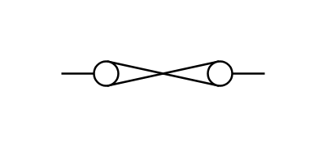

# Fuse (obsolete)

## Definition

```js
{
  _style: {
    entity: 'pointerEvents=1;verticalLabelPosition=bottom;shadow=0;dashed=0;align=center;html=1;verticalAlign=top;shape=mxgraph.electrical.miscellaneous.fuse_3;',
  },
  _width: 100,
  _height: 12,
}
```

## Usage

```js
import { FuseObsolete } from '@dinghy/standard-components-diagrams/electricalMisc'

<FuseObsolete/>
```

## Preview


