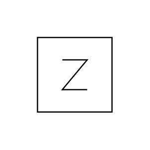

# Generic Component

## Definition

```js
{
  _style: {
    entity: 'pointerEvents=1;verticalLabelPosition=bottom;shadow=0;dashed=0;align=center;html=1;verticalAlign=top;shape=mxgraph.electrical.miscellaneous.generic_component',
  },
  _original_width: 60,
  _original_height: 60,

}
```

## Usage

```js
import { GenericComponent } from '@dinghy/standard-components-diagrams/electricalMisc'

<GenericComponent/>
```

## Preview


