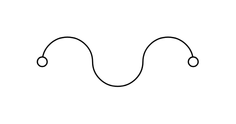

# Sensing Link Squib

## Definition

```js
{
  _style: {
    entity: 'pointerEvents=1;verticalLabelPosition=bottom;shadow=0;dashed=0;align=center;html=1;verticalAlign=top;shape=mxgraph.electrical.miscellaneous.sensing_link_squib',
  },
  _width: 130,
  _height: 40,
}
```

## Usage

```js
import { SensingLinkSquib } from '@dinghy/standard-components-diagrams/electricalMisc'

<SensingLinkSquib/>
```

## Preview


