# Electrical Transistors Entities

- [BjtNpn](./bjt-npn.md)  
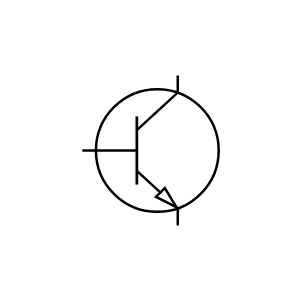

- [BjtNpn2](./bjt-npn-2.md)  
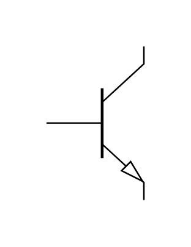

- [BjtPnp](./bjt-pnp.md)  
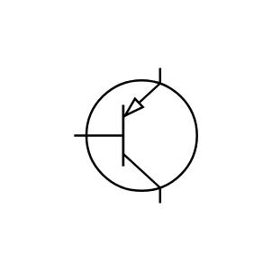

- [BjtPnp2](./bjt-pnp-2.md)  
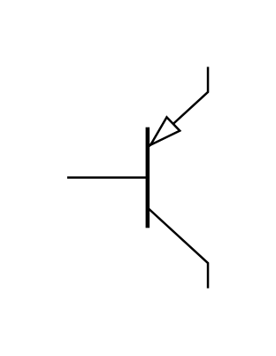

- [DualGateMosfetN](./dual-gate-mosfet-n.md)  
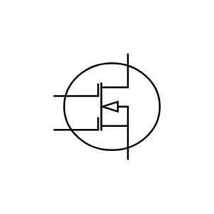

- [DualGateMosfetP](./dual-gate-mosfet-p.md)  
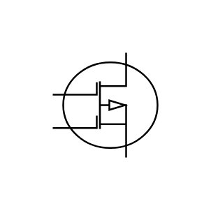

- [MosfetN](./mosfet-n.md)  
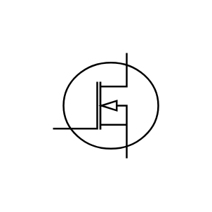

- [MosfetP](./mosfet-p.md)  
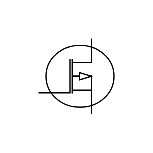

- [MosfetNoBulkN](./mosfet-no-bulk-n.md)  
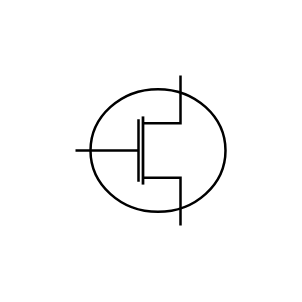

- [MosfetNoBulkP](./mosfet-no-bulk-p.md)  

- [NChannelJfet](./n-channel-jfet.md)  
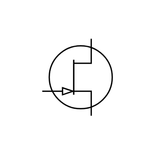

- [Nigbt](./nigbt.md)  

- [Nmos](./nmos.md)  
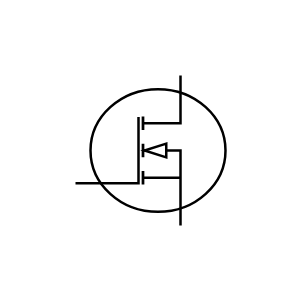

- [Nmos2](./nmos-2.md)  

- [NmosWithBulk](./nmos-with-bulk.md)  
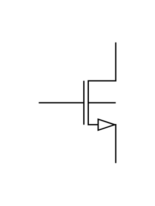

- [PChannelJfet](./p-channel-jfet.md)  

- [Pigbt](./pigbt.md)  
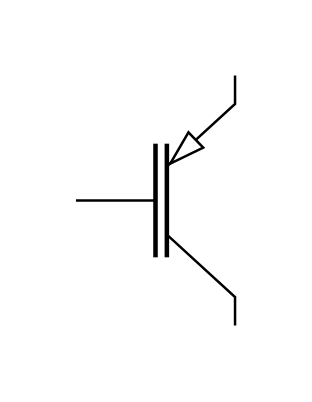

- [Pmos](./pmos.md)  

- [Pmos2](./pmos-2.md)  

- [PmosWithBulk](./pmos-with-bulk.md)  

