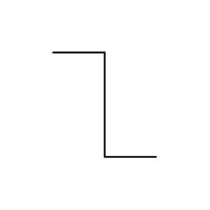

# Step 2

## Definition

```js
{
  _style: {
    entity: 'pointerEvents=1;verticalLabelPosition=bottom;shadow=0;dashed=0;align=center;html=1;verticalAlign=top;shape=mxgraph.electrical.waveforms.step_2;',
  },
  _original_width: 90,
  _original_height: 90,

}
```

## Usage

```js
import { Step2 } from '@dinghy/standard-components-diagrams/electricalWaveforms'

<Step2/>
```

## Preview


