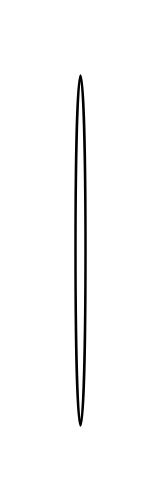

# Round kitchen table

## Definition

```js
{
  _style: {
    entity: 'shape=ellipse;shadow=0;html=1;',
  },
  _width: 4,
  _height: 140,
}
```

## Usage

```js
import { RoundKitchenTable } from '@dinghy/standard-components-diagrams/floorPlans'

<RoundKitchenTable/>
```

## Preview


