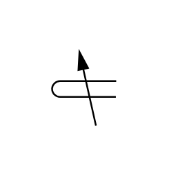

# X10020 Plunger with

## Definition

```js
{
  _style: {
    entity: 'verticalLabelPosition=bottom;aspect=fixed;html=1;verticalAlign=top;fillColor=strokeColor;align=center;outlineConnect=0;shape=mxgraph.fluid_power.x10020;points=[[0,0.5,0],[1,0.39,0],[1,0.61,0]]',
  },
  _width: 37.18,
  _height: 42.84,
}
```

## Usage

```js
import { X10020PlungerWith } from '@dinghy/standard-components-diagrams/fluidPower'

<X10020PlungerWith/>
```

## Preview


