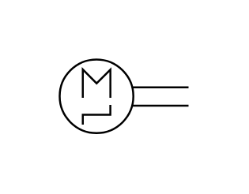

# X10070 Control mechanism

## Definition

```js
{
  _style: {
    entity: 'verticalLabelPosition=bottom;aspect=fixed;html=1;verticalAlign=top;fillColor=strokeColor;align=center;outlineConnect=0;shape=mxgraph.fluid_power.x10070;points=[[1,0.38,0],[1,0.5,0],[1,0.62,0]]',
  },
  _width: 65.2,
  _height: 37.28,
}
```

## Usage

```js
import { X10070ControlMechanism } from '@dinghy/standard-components-diagrams/fluidPower'

<X10070ControlMechanism/>
```

## Preview


