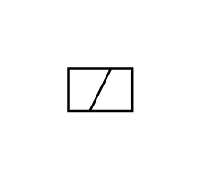

# X10110 Solenoid coil

## Definition

```js
{
  _style: {
    entity: 'verticalLabelPosition=bottom;aspect=fixed;html=1;verticalAlign=top;fillColor=strokeColor;align=center;outlineConnect=0;shape=mxgraph.fluid_power.x10110;points=[[0,0,0],[0,0.5,0],[0,1,0],[1,0,0],[1,0.5,0],[1,1,0],[0.5,0,0],[0.5,1,0]]',
  },
  _width: 27.88,
  _height: 18.66,
}
```

## Usage

```js
import { X10110SolenoidCoil } from '@dinghy/standard-components-diagrams/fluidPower'

<X10110SolenoidCoil/>
```

## Preview


