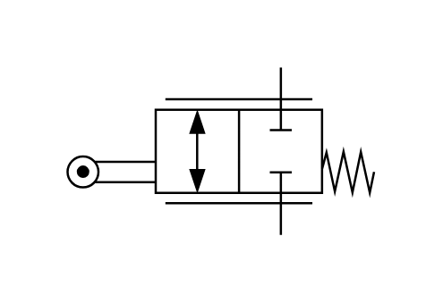

# X10650 Flow-control valve,

## Definition

```js
{
  _style: {
    entity: 'verticalLabelPosition=bottom;aspect=fixed;html=1;verticalAlign=top;fillColor=strokeColor;align=center;outlineConnect=0;shape=mxgraph.fluid_power.x10650;points=[[0.695,0,0],[0.695,1,0]]',
  },
  _width: 137,
  _height: 74.92,
}
```

## Usage

```js
import { X10650FlowControlValve } from '@dinghy/standard-components-diagrams/fluidPower'

<X10650FlowControlValve/>
```

## Preview


