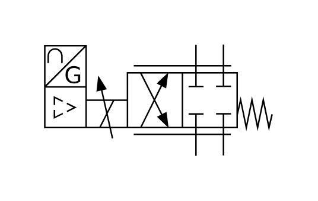

# X10900 Proportional flow-control

## Definition

```js
{
  _style: {
    entity: 'verticalLabelPosition=bottom;aspect=fixed;html=1;verticalAlign=top;fillColor=strokeColor;align=center;outlineConnect=0;shape=mxgraph.fluid_power.x10900;points=[[0.665,0,0],[0.665,1,0],[0.785,0,0],[0.785,1,0]]',
  },
  _width: 153.26,
  _height: 75.16,
}
```

## Usage

```js
import { X10900ProportionalFlowControl } from '@dinghy/standard-components-diagrams/fluidPower'

<X10900ProportionalFlowControl/>
```

## Preview


