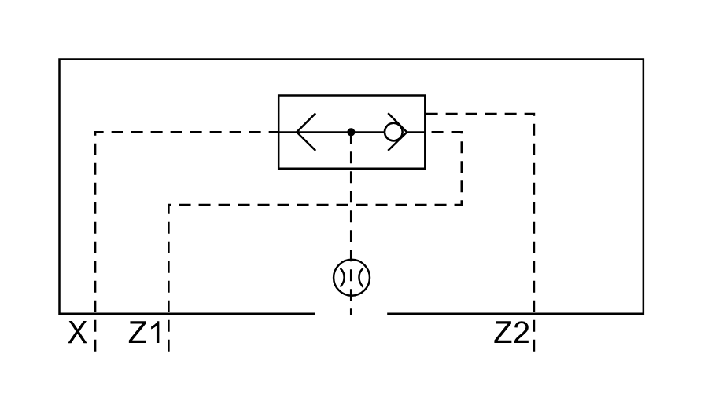

# X11090 Control cover

## Definition

```js
{
  _style: {
    entity: 'verticalLabelPosition=bottom;aspect=fixed;html=1;verticalAlign=top;fillColor=strokeColor;align=center;outlineConnect=0;shape=mxgraph.fluid_power.x11090;points=[[0.062,1,0],[0.187,1,0],[0.5,0.875,0],[0.814,1,0]]',
  },
  _width: 296.94,
  _height: 148.92,
}
```

## Usage

```js
import { X11090ControlCover } from '@dinghy/standard-components-diagrams/fluidPower'

<X11090ControlCover/>
```

## Preview


