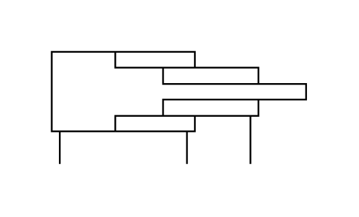

# X11510 Telescopic cylinder,

## Definition

```js
{
  _style: {
    entity: 'verticalLabelPosition=bottom;aspect=fixed;html=1;verticalAlign=top;fillColor=strokeColor;align=center;outlineConnect=0;shape=mxgraph.fluid_power.x11510;points=[[0.03,1,0],[0.53,1,0],[0.78,1,0]]',
  },
  _width: 148.52,
  _height: 65.34,
}
```

## Usage

```js
import { X11510TelescopicCylinder } from '@dinghy/standard-components-diagrams/fluidPower'

<X11510TelescopicCylinder/>
```

## Preview


