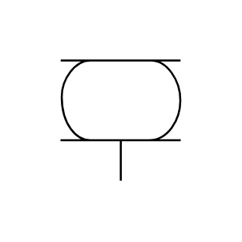

# X11600 Bellows cylinder

## Definition

```js
{
  _style: {
    entity: 'verticalLabelPosition=bottom;aspect=fixed;html=1;verticalAlign=top;fillColor=strokeColor;align=center;outlineConnect=0;shape=mxgraph.fluid_power.x11600;points=[[0.5,1,0]]',
  },
  _original_width: 75.04,
  _original_height: 56,

}
```

## Usage

```js
import { X11600BellowsCylinder } from '@dinghy/standard-components-diagrams/fluidPower'

<X11600BellowsCylinder/>
```

## Preview


