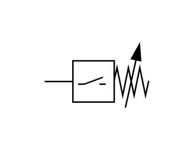

# X11750 Pressure switch,

## Definition

```js
{
  _style: {
    entity: 'verticalLabelPosition=bottom;aspect=fixed;html=1;verticalAlign=top;fillColor=strokeColor;align=center;outlineConnect=0;shape=mxgraph.fluid_power.x11750;points=[[0,0.58,0]]',
  },
  _width: 70.4,
  _height: 42.74,
}
```

## Usage

```js
import { X11750PressureSwitch } from '@dinghy/standard-components-diagrams/fluidPower'

<X11750PressureSwitch/>
```

## Preview


