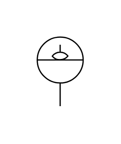

# X11870 Fluid-level indicator

## Definition

```js
{
  _style: {
    entity: 'verticalLabelPosition=bottom;aspect=fixed;html=1;verticalAlign=top;fillColor=strokeColor;align=center;outlineConnect=0;shape=mxgraph.fluid_power.x11870;points=[[0.5,1,0]]',
  },
  _width: 37.44,
  _height: 56.18,
}
```

## Usage

```js
import { X11870FluidLevelIndicator } from '@dinghy/standard-components-diagrams/fluidPower'

<X11870FluidLevelIndicator/>
```

## Preview


