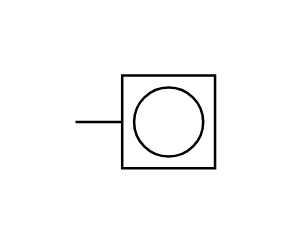

# X11960 Counter

## Definition

```js
{
  _style: {
    entity: 'verticalLabelPosition=bottom;aspect=fixed;html=1;verticalAlign=top;fillColor=strokeColor;align=center;outlineConnect=0;shape=mxgraph.fluid_power.x11960;points=[[0,0.5,0]]',
  },
  _width: 55.82,
  _height: 37.14,
}
```

## Usage

```js
import { X11960Counter } from '@dinghy/standard-components-diagrams/fluidPower'

<X11960Counter/>
```

## Preview


