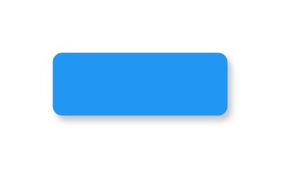

# Raised Button (Normal) 2

## Definition

```js
{
  _style: {
    entity: 'whiteSpace=wrap;html=1;dashed=0;align=center;fontSize=12;shape=rect;fillColor=#2196F3;strokeColor=none;fontStyle=1;shadow=1;fontColor=#ffffff;',
  },
  _width: 100,
  _height: 36,
}
```

## Usage

```js
import { RaisedButtonNormal2 } from '@dinghy/standard-components-diagrams/gmdlButtons'

<RaisedButtonNormal2/>
```

## Preview


