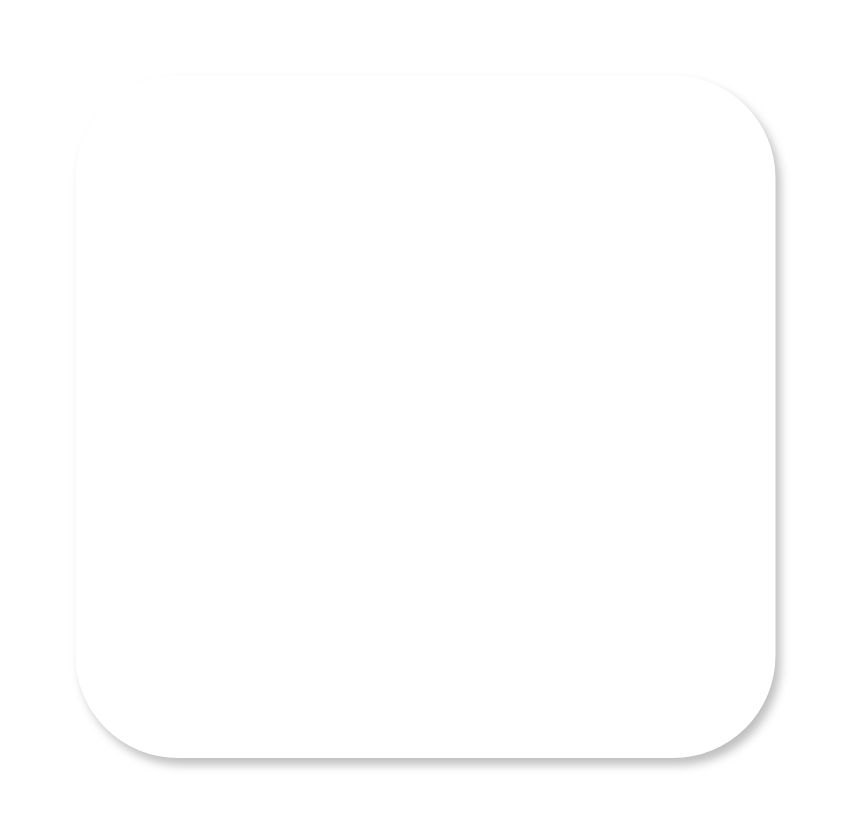
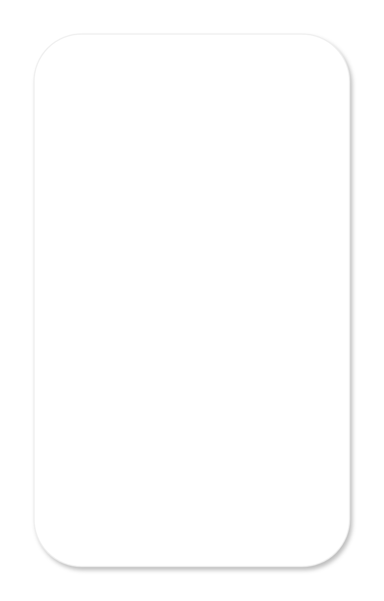
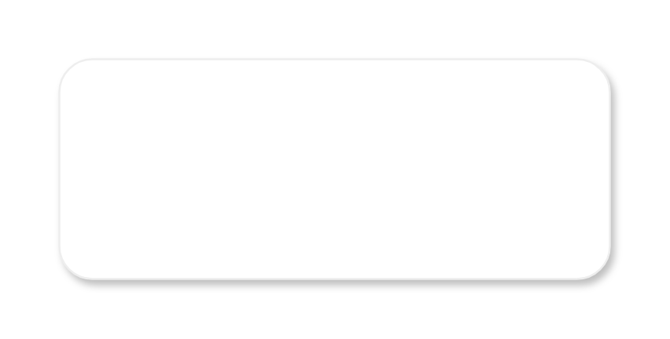

# Gmdl Dialogs Entities

- [Dialog](./dialog.md)  

- [DialogWithPersistentFooterButton](./dialog-with-persistent-footer-button.md)  

- [DialogWithScrollableList](./dialog-with-scrollable-list.md)  

- [DialogWithScrollableList2](./dialog-with-scrollable-list-2.md)  

- [FullscreenDialog](./fullscreen-dialog.md)  

- [MessageDialog](./message-dialog.md)  

- [SimpleDialog](./simple-dialog.md)  

- [SimpleDialog2](./simple-dialog-2.md)  

