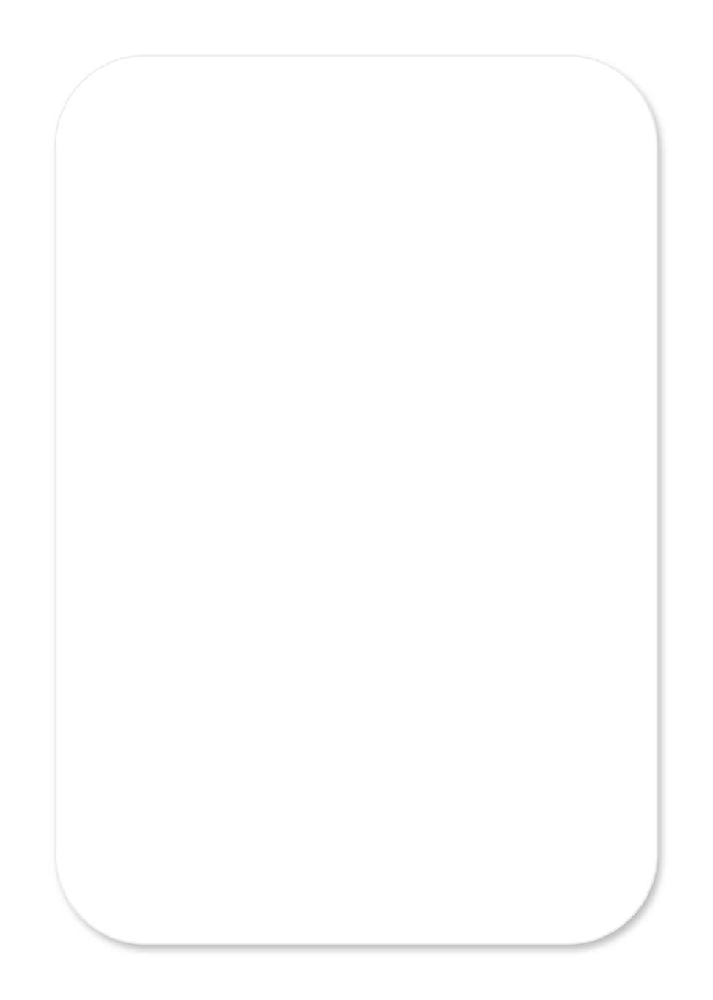

# Time picker

## Definition

```js
{
  _style: {
    entity: 'shape=rect;fillColor=#ffffff;strokeColor=#eeeeee;shadow=1;aspect=fixed;',
  },
  _width: 328,
  _height: 484,
}
```

## Usage

```js
import { TimePicker } from '@dinghy/standard-components-diagrams/gmdlPickers'

<TimePicker/>
```

## Preview


