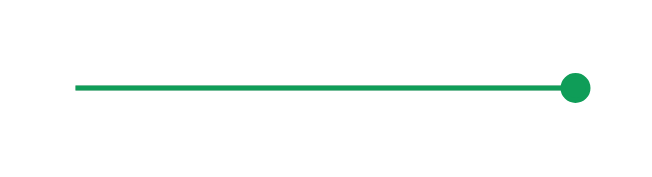

# Discrete slider (normal) 2

## Definition

```js
{
  _style: {
    entity: 'dashed=0;verticalLabelPosition=bottom;verticalAlign=top;align=center;shape=mxgraph.gmdl.slider2;barPos=100;strokeColor=#0F9D58;opacity=100;strokeWidth=2;fillColor=#0F9D58;handleSize=10;shadow=0;html=1;',
  },
  _width: 200,
  _height: 10,
}
```

## Usage

```js
import { DiscreteSliderNormal2 } from '@dinghy/standard-components-diagrams/gmdlSliders'

<DiscreteSliderNormal2/>
```

## Preview


