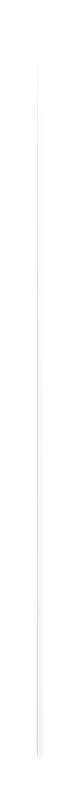

# Ribbon List 2

## Definition

```js
{
  _style: {
    entity: 'shape=manualInput;whiteSpace=wrap;html=1;shadow=1;strokeColor=none;fillColor=#dddddd;fontSize=15;fontColor=#444444;align=right;direction=south;flipH=1;shadow=1;spacing=10;fontStyle=1;',
  },
  _width: 1,
  _height: 590,
}
```

## Usage

```js
import { RibbonList2 } from '@dinghy/standard-components-diagrams/infoGraphic'

<RibbonList2/>
```

## Preview


