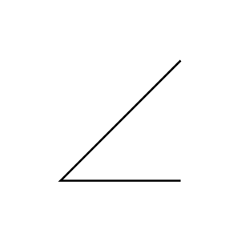

# Support Bracket

## Definition

```js
{
  _style: {
    entity: 'shape=mxgraph.pid.apparatus_elements.support_bracket;html=1;pointerEvents=1;align=center;verticalLabelPosition=bottom;verticalAlign=top;dashed=0;',
  },
  _original_width: 10,
  _original_height: 10,

}
```

## Usage

```js
import { SupportBracket } from '@dinghy/standard-components-diagrams/procEngApparatusElements'

<SupportBracket/>
```

## Preview


