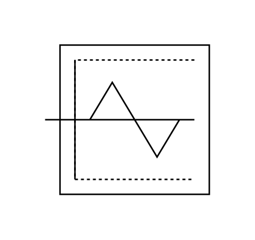

# Centrifuge (Screw, Perforated Shell)

## Definition

```js
{
  _style: {
    entity: 'shape=mxgraph.pid.centrifuges.centrifuge_(screw,_perforated_shell);html=1;pointerEvents=1;align=center;verticalLabelPosition=bottom;verticalAlign=top;dashed=0;',
  },
  _width: 110,
  _height: 100,
}
```

## Usage

```js
import { CentrifugeScrewPerforatedShell } from '@dinghy/standard-components-diagrams/procEngCentrifuges'

<CentrifugeScrewPerforatedShell/>
```

## Preview


