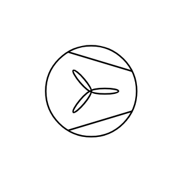
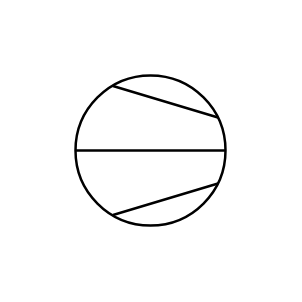
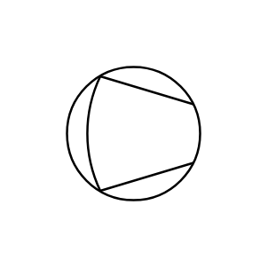
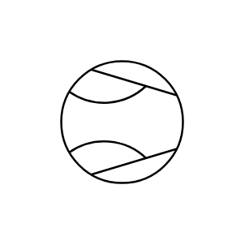
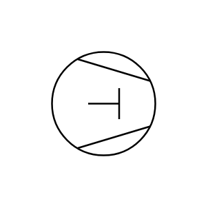
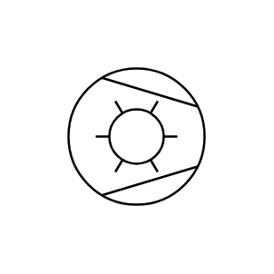
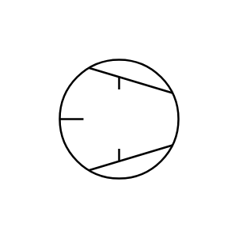
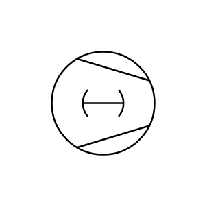
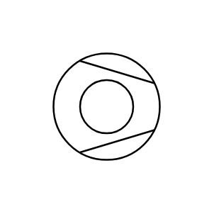
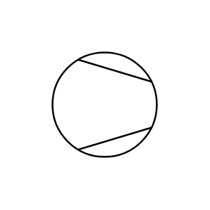

# Proc Eng Compressors ISO Entities

- [BlowerFan](./blower-fan.md)  

- [CompressorCentrifugal](./compressor-centrifugal.md)  

- [CompressorDiaphragm](./compressor-diaphragm.md)  

- [CompressorEjector](./compressor-ejector.md)  

- [CompressorPiston](./compressor-piston.md)  

- [CompressorRing](./compressor-ring.md)  

- [CompressorRollerVane](./compressor-roller-vane.md)  

- [CompressorRotary](./compressor-rotary.md)  

- [CompressorScrew](./compressor-screw.md)  

- [CompressorTurbo](./compressor-turbo.md)  

- [CompressorVacuumPump](./compressor-vacuum-pump.md)  

