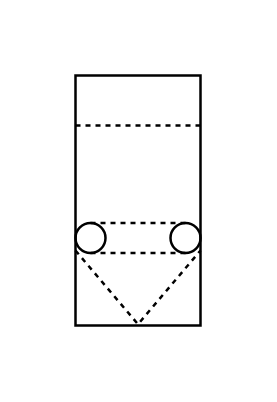

# Gas Filter (Belt, Roll)

## Definition

```js
{
  _style: {
    entity: 'verticalLabelPosition=bottom;align=center;dashed=0;html=1;verticalAlign=top;shape=mxgraph.pid.filters.gas_filter_(belt,_roll);',
  },
  _width: 50,
  _height: 100,
}
```

## Usage

```js
import { GasFilterBeltRoll } from '@dinghy/standard-components-diagrams/procEngFilters'

<GasFilterBeltRoll/>
```

## Preview


