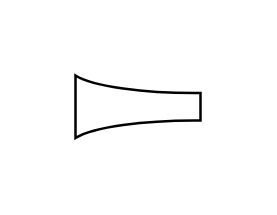

# Flow Nozzle

## Definition

```js
{
  _style: {
    entity: 'verticalLabelPosition=bottom;align=center;outlineConnect=0;dashed=0;html=1;verticalAlign=top;shape=mxgraph.pid.flow_sensors.flow_nozzle;',
  },
  _width: 50,
  _height: 25,
}
```

## Usage

```js
import { FlowNozzle } from '@dinghy/standard-components-diagrams/procEngFlowSensors'

<FlowNozzle/>
```

## Preview


