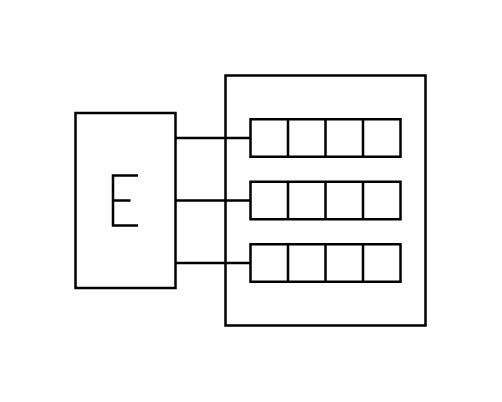

# Electric Heater

## Definition

```js
{
  _style: {
    entity: 'shape=mxgraph.pid.heat_exchangers.electric_heater;html=1;pointerEvents=1;align=center;verticalLabelPosition=bottom;verticalAlign=top;dashed=0;',
  },
  _width: 140,
  _height: 100,
}
```

## Usage

```js
import { ElectricHeater } from '@dinghy/standard-components-diagrams/procEngHeatExchangers'

<ElectricHeater/>
```

## Preview


