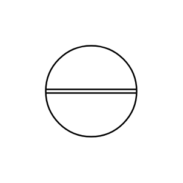

# Discrete Instrument (local panel)

## Definition

```js
{
  _style: {
    entity: 'html=1;outlineConnect=0;align=center;dashed=0;aspect=fixed;shape=mxgraph.pid2inst.discInst;mounting=local',
  },
  _original_width: 50,
  _original_height: 50,

}
```

## Usage

```js
import { DiscreteInstrumentLocalPanel } from '@dinghy/standard-components-diagrams/procEngInstruments'

<DiscreteInstrumentLocalPanel/>
```

## Preview


