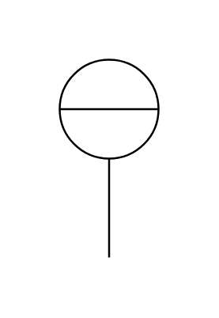

# Indicator (Instrument)

## Definition

```js
{
  _style: {
    entity: 'html=1;outlineConnect=0;align=center;dashed=0;shape=mxgraph.pid2inst.indicator;mounting=room;overflow=fill;indType=inst',
  },
  _width: 50,
  _height: 100,
}
```

## Usage

```js
import { IndicatorInstrument } from '@dinghy/standard-components-diagrams/procEngInstruments'

<IndicatorInstrument/>
```

## Preview


