# Proc Eng Misc Entities

- [AeratorWithSparger](./aerator-with-sparger.md)  
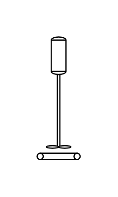

- [AirCooler](./air-cooler.md)  
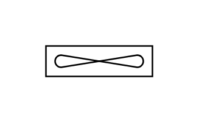

- [AirFilter](./air-filter.md)  
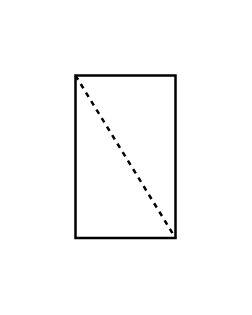

- [AirSeparator](./air-separator.md)  
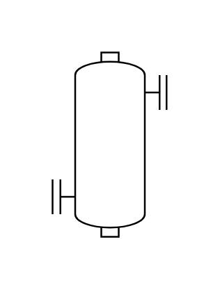

- [BackDraftDamper](./back-draft-damper.md)  
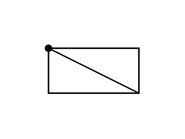

- [BagFillingMachine](./bag-filling-machine.md)  

- [BeltSkimmer](./belt-skimmer.md)  

- [Bin](./bin.md)  

- [BoilerDomeHotLiquid](./boiler-dome-hot-liquid.md)  

- [BoilerDome](./boiler-dome.md)  
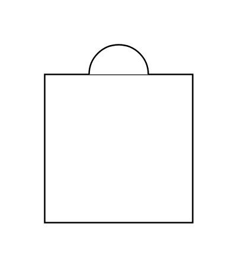

- [BoxTruck](./box-truck.md)  
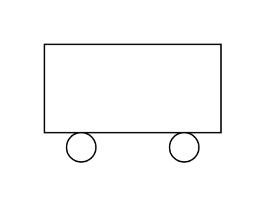

- [BucketElevator](./bucket-elevator.md)  
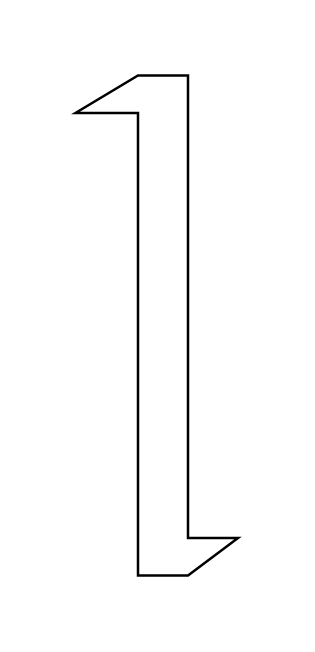

- [Chiller](./chiller.md)  
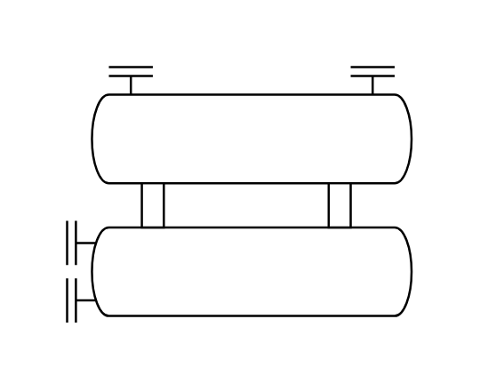

- [Column](./column.md)  
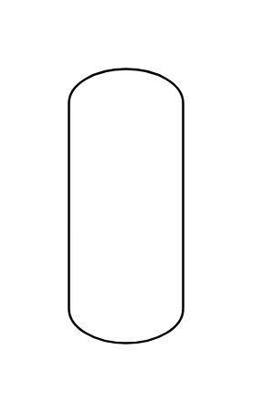

- [ColumnBubbleCapTrays](./column-bubble-cap-trays.md)  
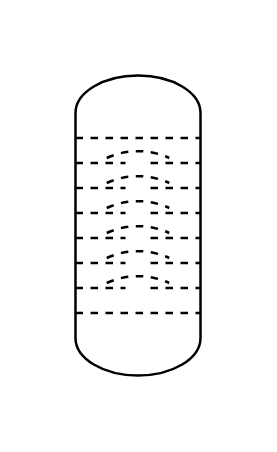

- [ColumnFixedBedSprayNozzle](./column-fixed-bed-spray-nozzle.md)  

- [ColumnFixedBed](./column-fixed-bed.md)  
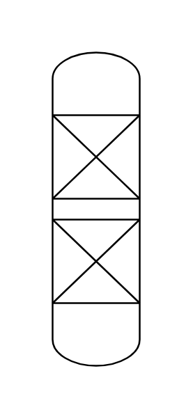

- [ColumnFluidizedBed](./column-fluidized-bed.md)  
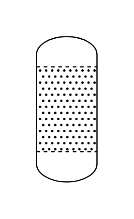

- [ColumnStaggeredBaffleTrays](./column-staggered-baffle-trays.md)  

- [ColumnTray](./column-tray.md)  

- [ColumnValveTrays](./column-valve-trays.md)  
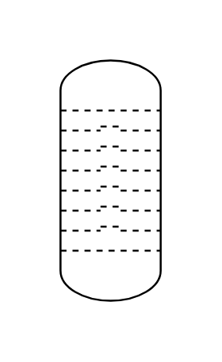

- [CombustionChamber](./combustion-chamber.md)  
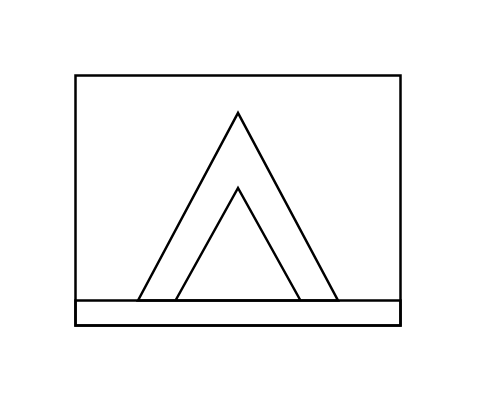

- [Conveyor](./conveyor.md)  
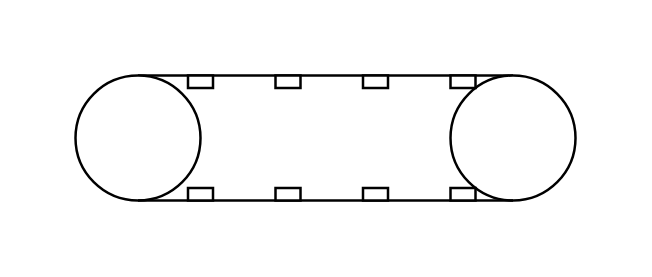

- [ConveyorBeltClosedReversible](./conveyor-belt-closed-reversible.md)  
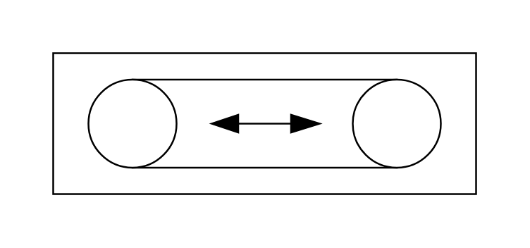

- [ConveyorBeltClosed](./conveyor-belt-closed.md)  
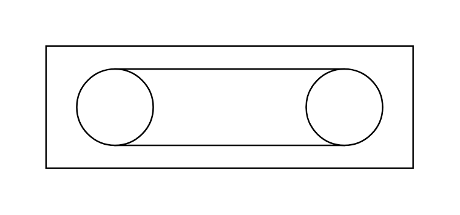

- [ConveyorBelt](./conveyor-belt.md)  
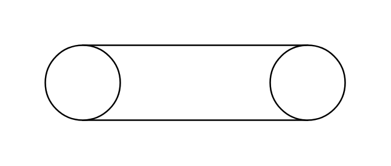

- [ConveyorChainClosed](./conveyor-chain-closed.md)  
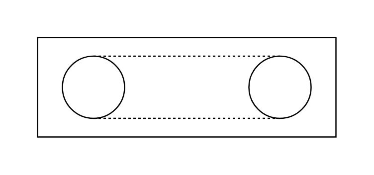

- [ConveyorScrewClosed](./conveyor-screw-closed.md)  
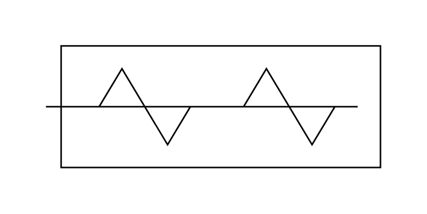

- [ConveyorVibratingClosed](./conveyor-vibrating-closed.md)  
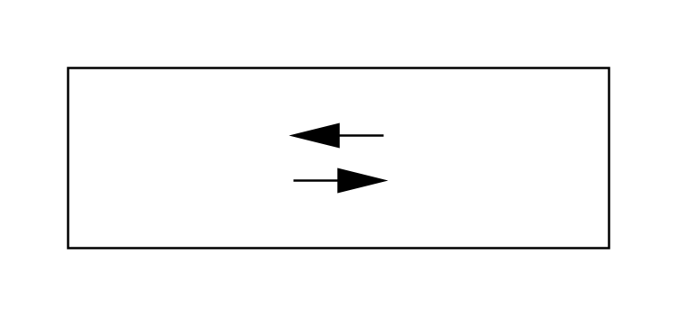

- [Conveyor2](./conveyor-2.md)  
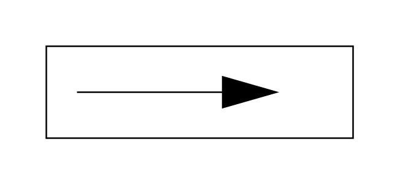

- [Cooler](./cooler.md)  
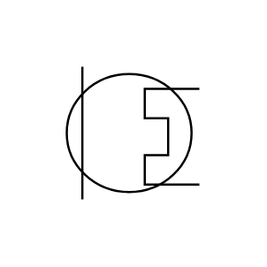

- [CoolingTower](./cooling-tower.md)  
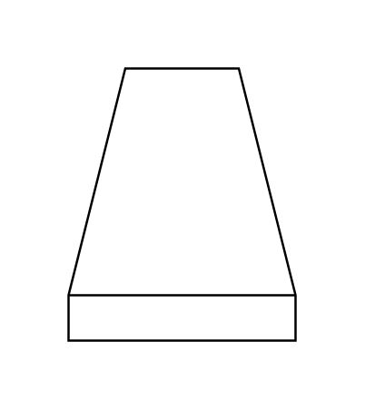

- [CoolingTowerDryForcedDraught](./cooling-tower-dry-forced-draught.md)  
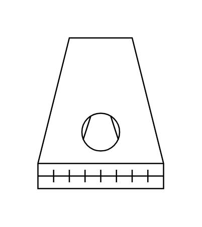

- [CoolingTowerDryInducedDraught](./cooling-tower-dry-induced-draught.md)  

- [CoolingTowerDryNaturalDraught](./cooling-tower-dry-natural-draught.md)  
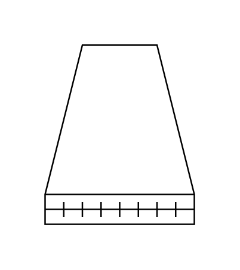

- [CoolingTowerWetDryNaturalDraught](./cooling-tower-wet-dry-natural-draught.md)  
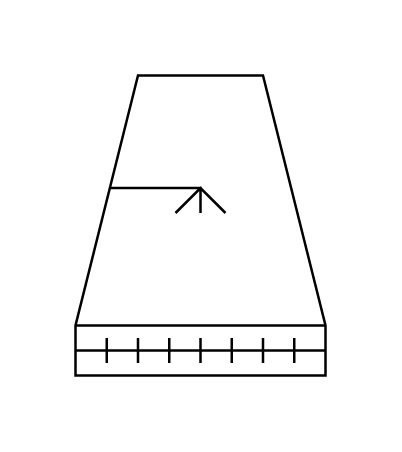

- [CoolingTowerWetForcedDraught](./cooling-tower-wet-forced-draught.md)  
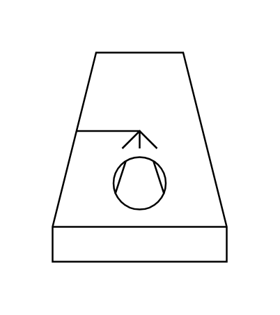

- [CoolingTowerWetInducedDraught](./cooling-tower-wet-induced-draught.md)  
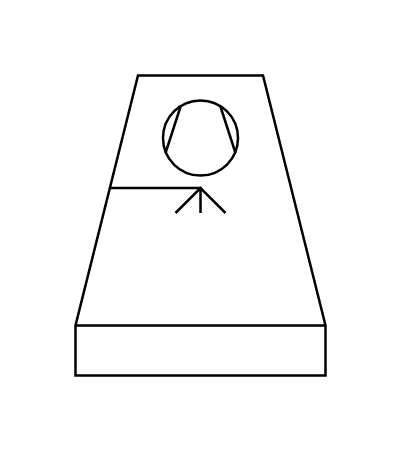

- [CoolingTowerWetNaturalDraught](./cooling-tower-wet-natural-draught.md)  
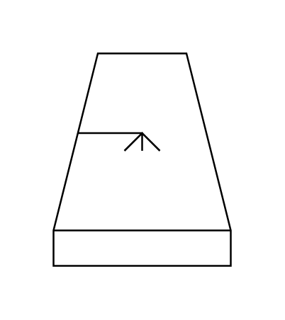

- [CoveredGasVent](./covered-gas-vent.md)  

- [Crane](./crane.md)  
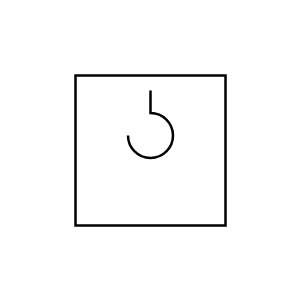

- [CurvedGasVent](./curved-gas-vent.md)  
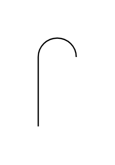

- [Cyclone](./cyclone.md)  
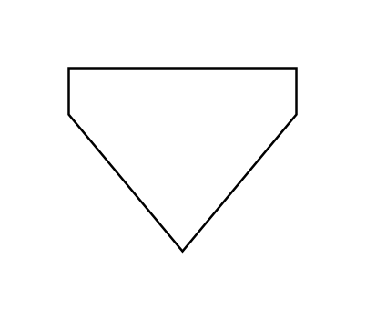

- [Dryer](./dryer.md)  
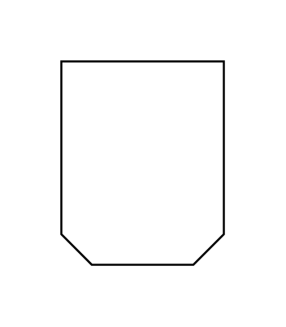

- [ElevatorBucketZForm](./elevator-bucket-z-form.md)  

- [ElevatorBucket](./elevator-bucket.md)  

- [Fan](./fan.md)  

- [Fan2](./fan-2.md)  
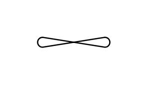

- [Fan3](./fan-3.md)  
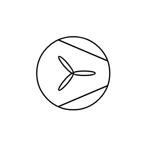

- [Filter](./filter.md)  

- [Filter2](./filter-2.md)  

- [FiringSystemBurner](./firing-system-burner.md)  
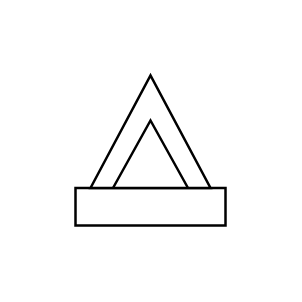

- [FlameArrestor](./flame-arrestor.md)  

- [FlexiblePipe](./flexible-pipe.md)  
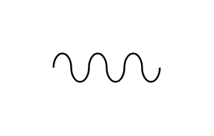

- [ForcedFlowAirCooler](./forced-flow-air-cooler.md)  
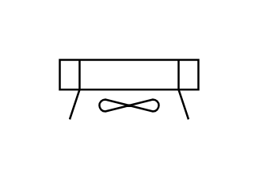

- [ForkliftManual](./forklift-manual.md)  
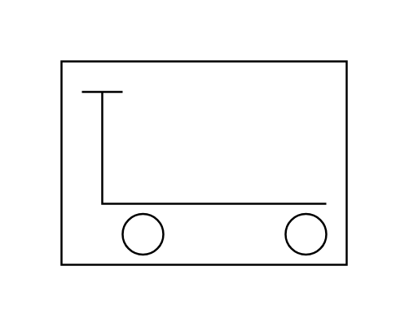

- [ForkliftTruck](./forklift-truck.md)  
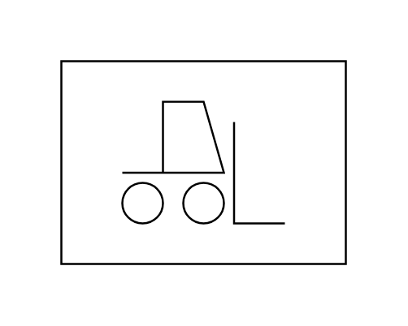

- [Funnel](./funnel.md)  
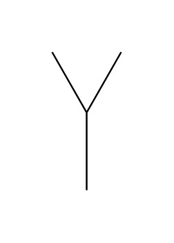

- [GasFlare](./gas-flare.md)  

- [InducedFlowAirCooler](./induced-flow-air-cooler.md)  
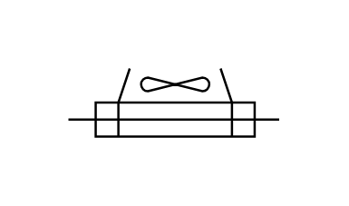

- [IndustrialTruck](./industrial-truck.md)  
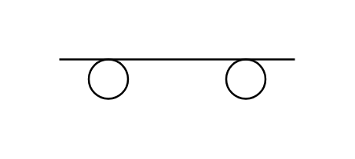

- [Lift](./lift.md)  
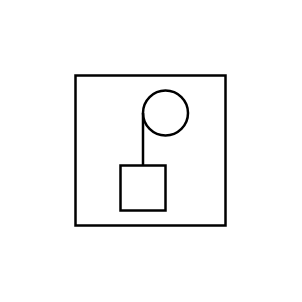

- [LoadingArm](./loading-arm.md)  
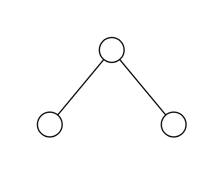

- [Mixer](./mixer.md)  
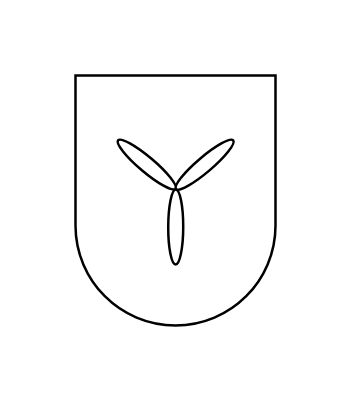

- [Palletizer](./palletizer.md)  

- [ProtectivePaletteCovering](./protective-palette-covering.md)  

- [RollerConveyor](./roller-conveyor.md)  

- [RollingBin](./rolling-bin.md)  
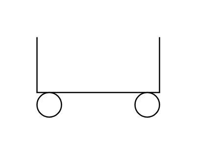

- [RotaryScreen](./rotary-screen.md)  
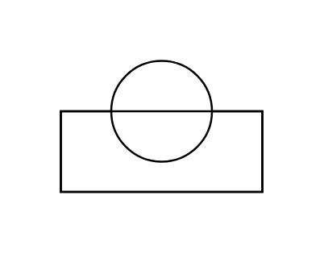

- [ScreeningDeviceSieveStrainer](./screening-device-sieve-strainer.md)  

- [ScreeningDeviceSieveStrainerBasketReel](./screening-device-sieve-strainer-basket-reel.md)  

- [ScreeningDeviceSieveStrainerCoarseAndFineScreens](./screening-device-sieve-strainer-coarse-and-fine-screens.md)  

- [ScreeningDeviceSieveStrainerCoarseRake](./screening-device-sieve-strainer-coarse-rake.md)  

- [ScreeningDeviceSieveStrainerFineRake](./screening-device-sieve-strainer-fine-rake.md)  

- [ScreeningDeviceSieveStrainerRotatingDrum](./screening-device-sieve-strainer-rotating-drum.md)  

- [ScreeningDeviceSieveStrainerVibrating](./screening-device-sieve-strainer-vibrating.md)  

- [Ship](./ship.md)  

- [Silencer](./silencer.md)  

- [SprayCooler](./spray-cooler.md)  

- [SprayingDevice](./spraying-device.md)  

- [StackChimney](./stack-chimney.md)  

- [SteamTrap](./steam-trap.md)  

- [TankCarTankWagon](./tank-car-tank-wagon.md)  

- [ViewingGlass](./viewing-glass.md)  

