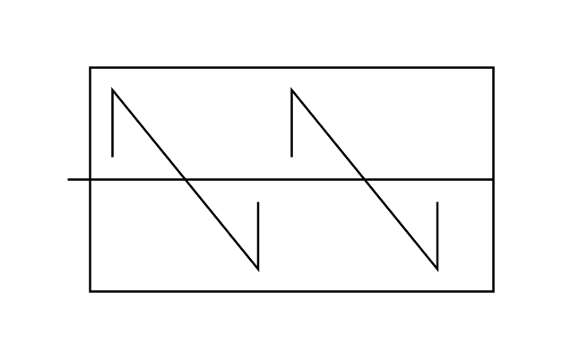

# In-Line Rotary Mixer

## Definition

```js
{
  _style: {
    entity: 'shape=mxgraph.pid.mixers.in-line_rotary_mixer;html=1;pointerEvents=1;align=center;verticalLabelPosition=bottom;verticalAlign=top;dashed=0;',
  },
  _width: 190,
  _height: 100,
}
```

## Usage

```js
import { InLineRotaryMixer } from '@dinghy/standard-components-diagrams/procEngMixers'

<InLineRotaryMixer/>
```

## Preview


