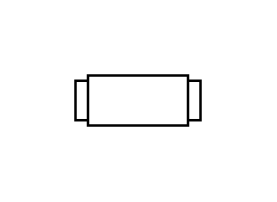

# Flame Arrestor

## Definition

```js
{
  _style: {
    entity: 'html=1;dashed=0;outlineConnect=0;align=center;shape=mxgraph.pid.piping.flame_arrestor;',
  },
  _width: 50,
  _height: 20,
}
```

## Usage

```js
import { FlameArrestor } from '@dinghy/standard-components-diagrams/procEngPiping'

<FlameArrestor/>
```

## Preview


