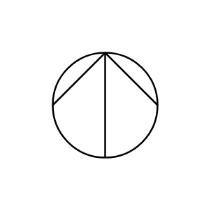
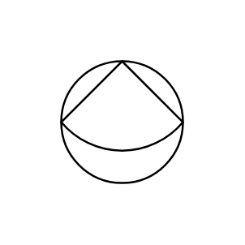
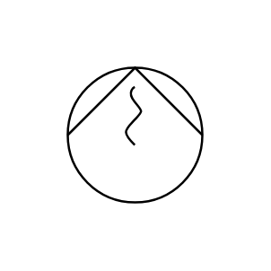
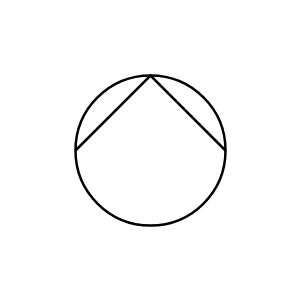
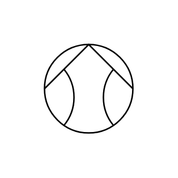
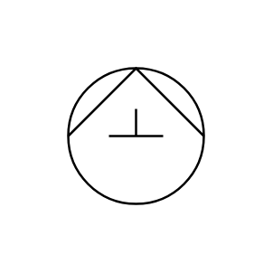
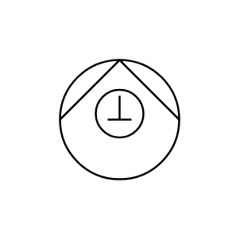
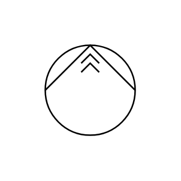

# Proc Eng Pumps DIN Entities

- [Centrifugal](./centrifugal.md)  

- [Diaphragm](./diaphragm.md)  

- [EccentricWorm](./eccentric-worm.md)  

- [Electromagnetic](./electromagnetic.md)  

- [Gear](./gear.md)  

- [Hydraulic](./hydraulic.md)  

- [LiquidJet](./liquid-jet.md)  

- [Reciprocating](./reciprocating.md)  

- [RotaryPiston](./rotary-piston.md)  

- [Screw](./screw.md)  

