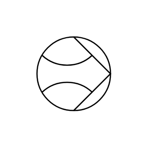
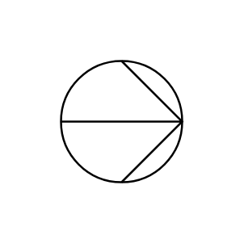
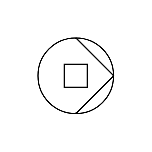
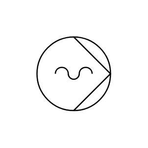
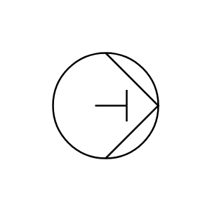

# Proc Eng Pumps ISO Entities

- [JetPumpLiquid](./jet-pump-liquid.md)  

- [PumpCentrifugal](./pump-centrifugal.md)  

- [PumpDiaphragm](./pump-diaphragm.md)  

- [PumpGear](./pump-gear.md)  

- [PumpLiquid](./pump-liquid.md)  

- [PumpPositiveDisplacement](./pump-positive-displacement.md)  

- [PumpProgressiveCavity](./pump-progressive-cavity.md)  

- [PumpReciprocatingPiston](./pump-reciprocating-piston.md)  

- [PumpScrew](./pump-screw.md)  

