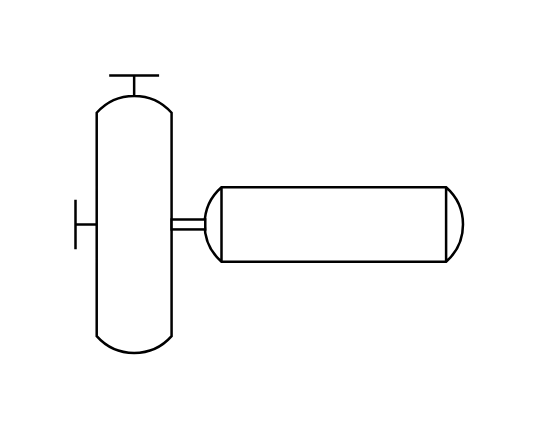

# Horizontal Pump

## Definition

```js
{
  _style: {
    entity: 'shape=mxgraph.pid.pumps.horizontal_pump;html=1;pointerEvents=1;align=center;verticalLabelPosition=bottom;verticalAlign=top;dashed=0;',
  },
  _width: 155,
  _height: 111,
}
```

## Usage

```js
import { HorizontalPump } from '@dinghy/standard-components-diagrams/procEngPumps'

<HorizontalPump/>
```

## Preview


