# Proc Eng Valves Entities

- [Component3WayValve](./component-3-way-valve.md)  
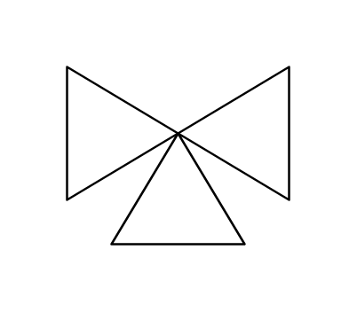

- [Component3WayValveManual](./component-3-way-valve-manual.md)  
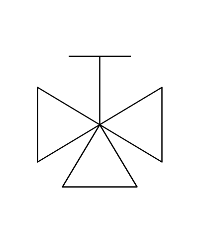

- [AngleBlowdownValve](./angle-blowdown-valve.md)  
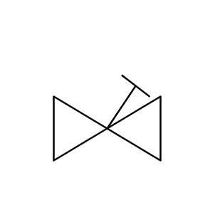

- [AngleGlobeValve](./angle-globe-valve.md)  
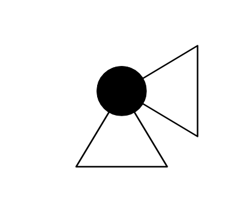

- [AngleGlobeValveManual](./angle-globe-valve-manual.md)  

- [AngleValve](./angle-valve.md)  

- [AngleValveManual](./angle-valve-manual.md)  

- [AutoRecirculationValve](./auto-recirculation-valve.md)  

- [BallValve](./ball-valve.md)  
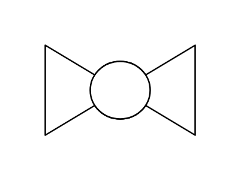

- [ButterflyValve](./butterfly-valve.md)  
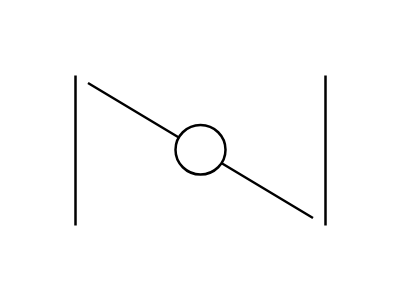

- [CheckValve](./check-valve.md)  

- [GateValve](./gate-valve.md)  
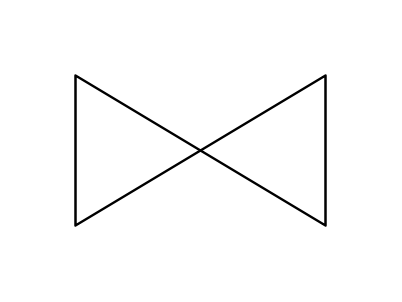

- [GateValveBalancedDiaphragm](./gate-valve-balanced-diaphragm.md)  

- [GateValveDiaphragm](./gate-valve-diaphragm.md)  
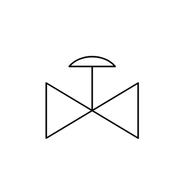

- [GateValveDigital](./gate-valve-digital.md)  

- [GateValveDoubleActingCylinder](./gate-valve-double-acting-cylinder.md)  

- [GateValveElectroHydraulic](./gate-valve-electro-hydraulic.md)  
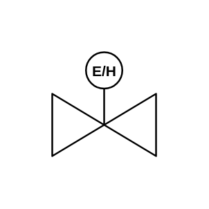

- [GateValveKey](./gate-valve-key.md)  

- [GateValveManual](./gate-valve-manual.md)  
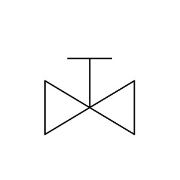

- [GateValveMotor](./gate-valve-motor.md)  
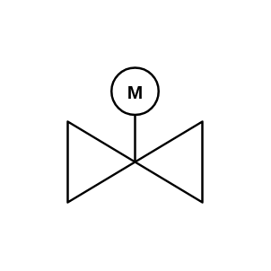

- [GateValvePilot](./gate-valve-pilot.md)  
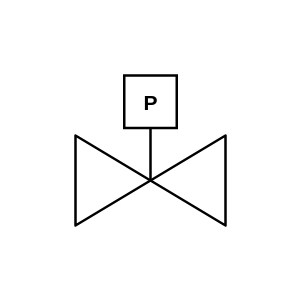

- [GateValvePowered](./gate-valve-powered.md)  

- [GateValveSingleActingCylinder](./gate-valve-single-acting-cylinder.md)  
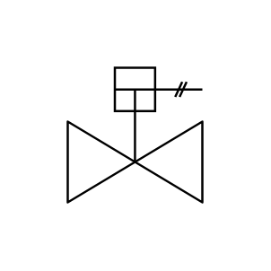

- [GateValveSolenoidWithManualReset](./gate-valve-solenoid-with-manual-reset.md)  

- [GateValveSolenoid](./gate-valve-solenoid.md)  
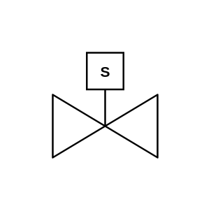

- [GateValveSpring](./gate-valve-spring.md)  
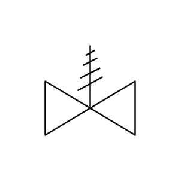

- [GateValveWeight](./gate-valve-weight.md)  
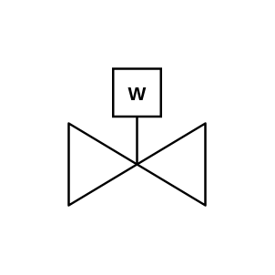

- [GlobeValve](./globe-valve.md)  
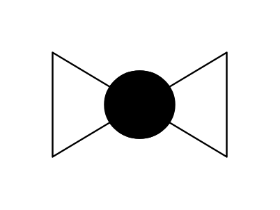

- [IntegratedBlockAndBleedValve](./integrated-block-and-bleed-valve.md)  
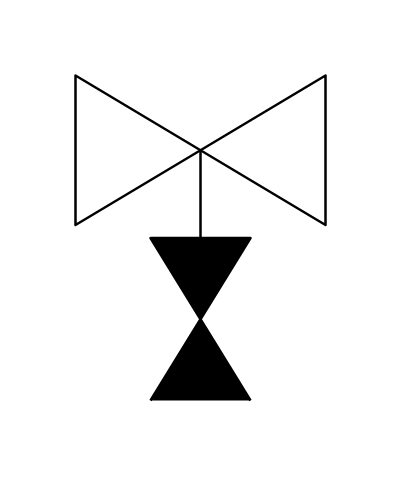

- [IntegratedBlockAndBleedValveManual](./integrated-block-and-bleed-valve-manual.md)  

- [NeedleValve](./needle-valve.md)  
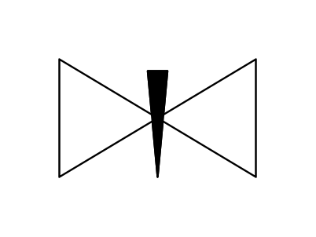

- [NormallyClosedBallValve](./normally-closed-ball-valve.md)  
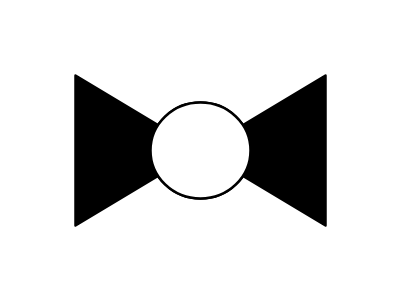

- [NormallyClosedGateValve](./normally-closed-gate-valve.md)  

- [PlugValve](./plug-valve.md)  

- [SelfDrainingValve](./self-draining-valve.md)  

