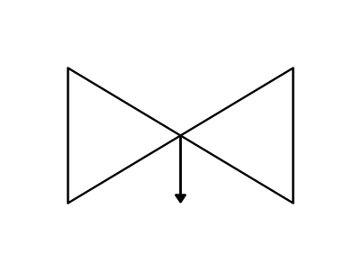

# Self Draining Valve

## Definition

```js
{
  _style: {
    entity: 'verticalLabelPosition=bottom;align=center;html=1;verticalAlign=top;pointerEvents=1;dashed=0;shape=mxgraph.pid2valves.valve;valveType=selfDrain',
  },
  _width: 100,
  _height: 60,
}
```

## Usage

```js
import { SelfDrainingValve } from '@dinghy/standard-components-diagrams/procEngValves'

<SelfDrainingValve/>
```

## Preview


