# Proc Eng Vessels Entities

- [Bag](./bag.md)  
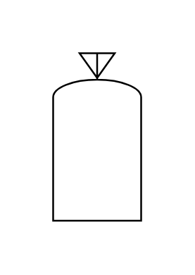

- [BagIso](./bag-iso.md)  
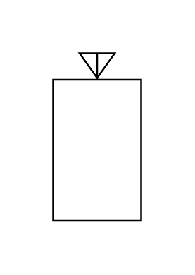

- [BarrelDrum](./barrel-drum.md)  
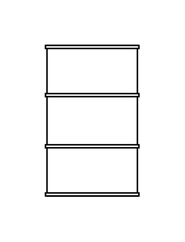

- [BarrelDrumIso](./barrel-drum-iso.md)  
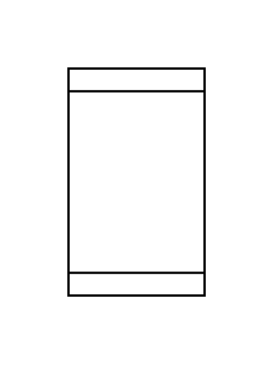

- [BunkerConicalBottom](./bunker-conical-bottom.md)  

- [ConcreteTank](./concrete-tank.md)  
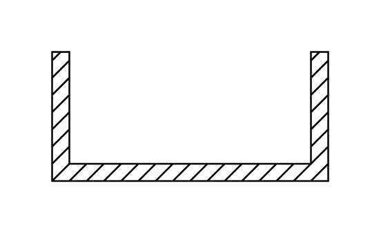

- [ContainerSolidsLiquidsGases](./container-solids-liquids-gases.md)  

- [ContainerTankCistern](./container-tank-cistern.md)  
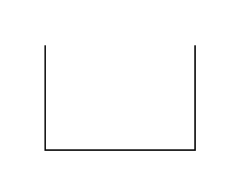

- [ContainerTankCisternBoot](./container-tank-cistern-boot.md)  
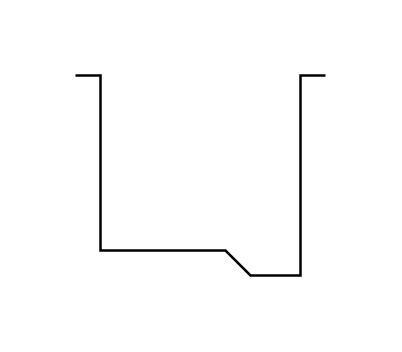

- [ContainerTankCisternBottom](./container-tank-cistern-bottom.md)  
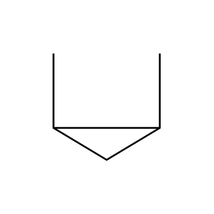

- [ContainerTankCisternLegs](./container-tank-cistern-legs.md)  
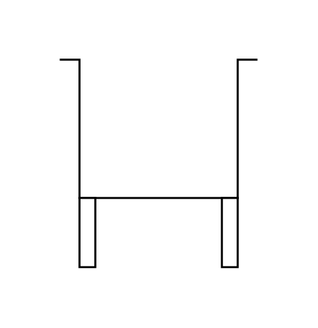

- [DoubleConcreteTank](./double-concrete-tank.md)  
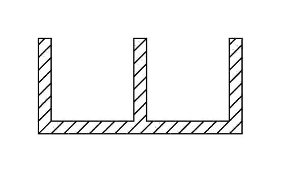

- [DrumOrCondenser](./drum-or-condenser.md)  
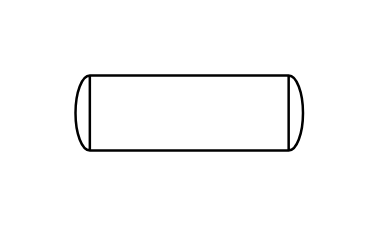

- [ForcedDraftCoolingTower](./forced-draft-cooling-tower.md)  

- [Furnace](./furnace.md)  
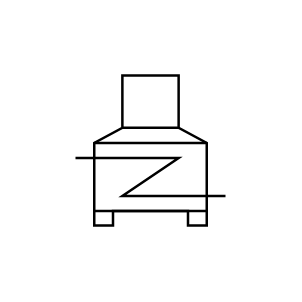

- [Furnace2](./furnace2.md)  
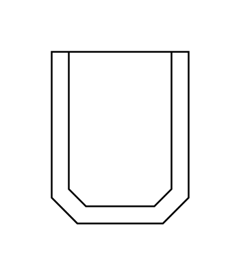

- [GasBottle](./gas-bottle.md)  
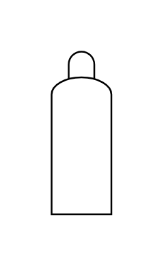

- [GasHolder](./gas-holder.md)  
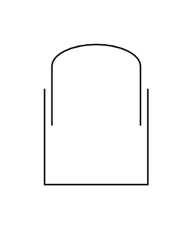

- [HalfPipeMixingVessel](./half-pipe-mixing-vessel.md)  
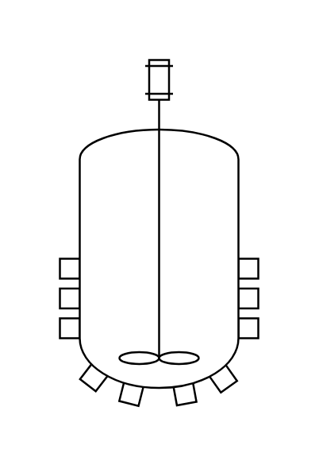

- [InducedDraftCoolingTower](./induced-draft-cooling-tower.md)  
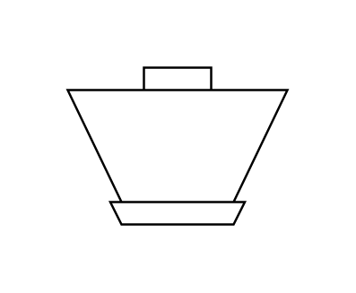

- [JacketedMixingVessel](./jacketed-mixing-vessel.md)  

- [KnockOutDrum](./knock-out-drum.md)  
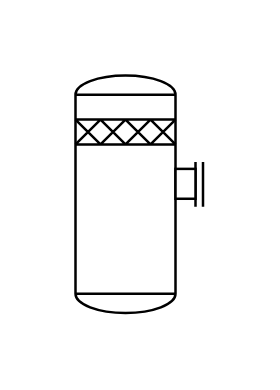

- [Mixer](./mixer.md)  
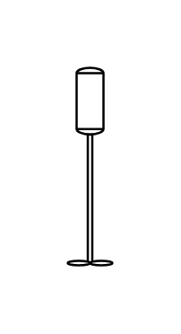

- [MixingReactor](./mixing-reactor.md)  
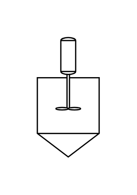

- [OpenBulkStorage](./open-bulk-storage.md)  
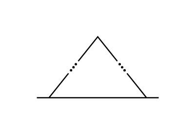

- [PressurizedVessel](./pressurized-vessel.md)  
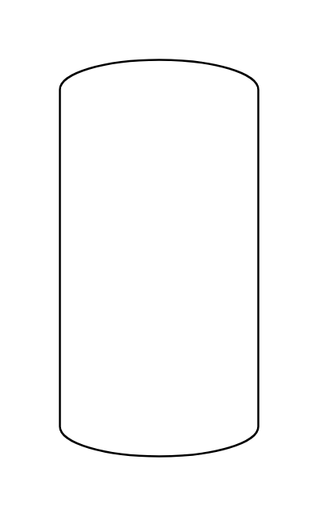

- [PropAgitator](./prop-agitator.md)  

- [Reactor](./reactor.md)  
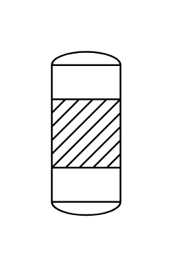

- [SettlingTank](./settling-tank.md)  
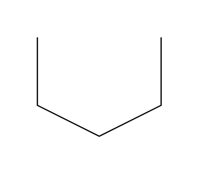

- [SprayDrier](./spray-drier.md)  
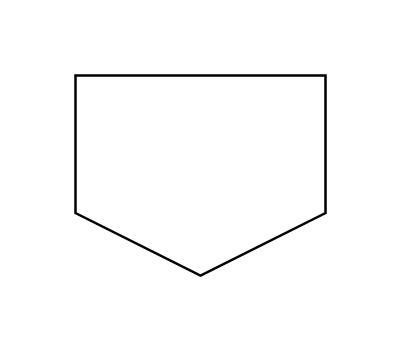

- [StorageSphere](./storage-sphere.md)  
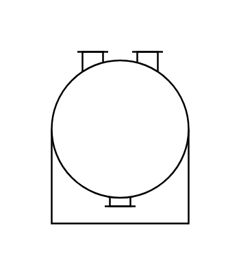

- [Tank](./tank.md)  
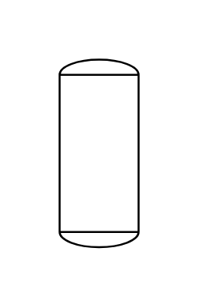

- [TankBoot](./tank-boot.md)  
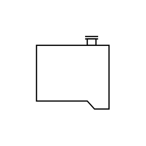

- [TankConcreteBase](./tank-concrete-base.md)  

- [TankConicalBottom](./tank-conical-bottom.md)  
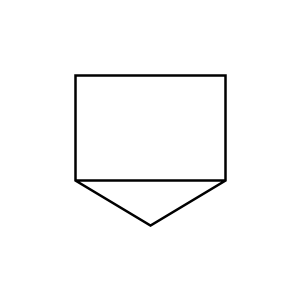

- [TankConicalRoofAndBottom](./tank-conical-roof-and-bottom.md)  
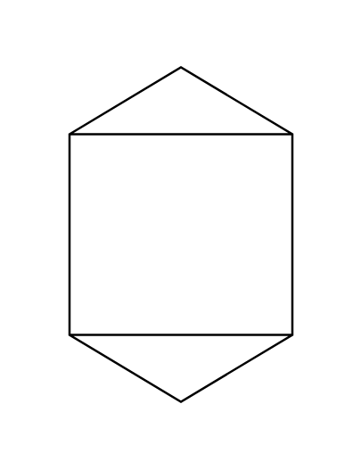

- [TankConicalRoof](./tank-conical-roof.md)  
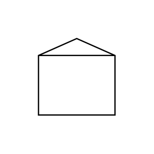

- [TankCoveredBoot](./tank-covered-boot.md)  
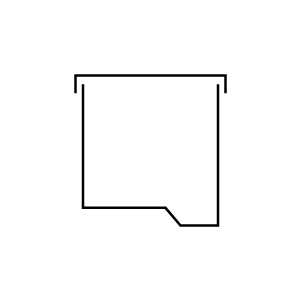

- [TankCovered](./tank-covered.md)  
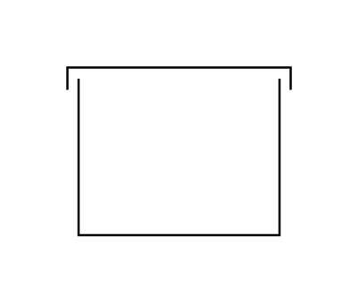

- [TankDishedRoofConicalBottom](./tank-dished-roof-conical-bottom.md)  

- [TankDishedRoof](./tank-dished-roof.md)  
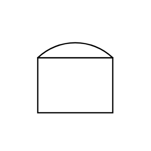

- [TankFalseBottom](./tank-false-bottom.md)  
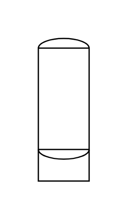

- [TankFloatingRoofBoot](./tank-floating-roof-boot.md)  
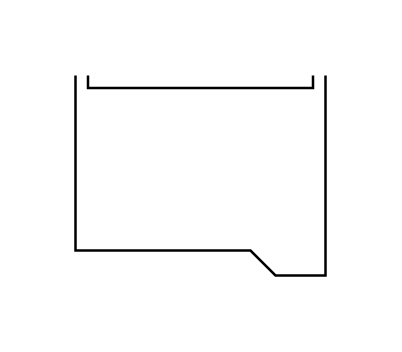

- [TankFloatingRoof](./tank-floating-roof.md)  
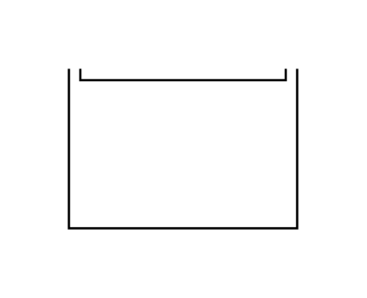

- [TankVessel](./tank-vessel.md)  
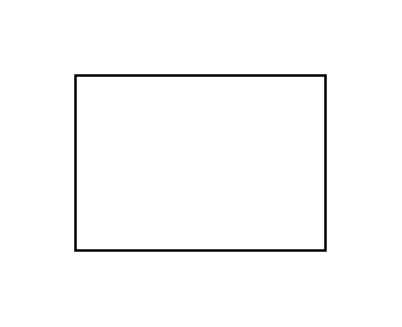

- [Tower](./tower.md)  
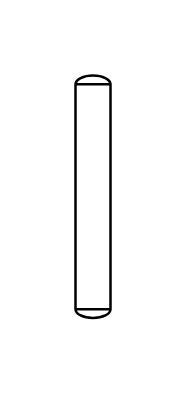

- [TowerWithPacking](./tower-with-packing.md)  
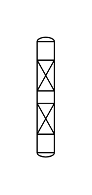

- [TurbineAgitator](./turbine-agitator.md)  
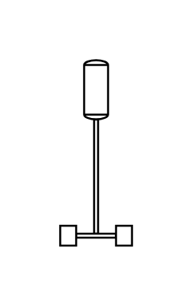

- [VentBent](./vent-bent.md)  
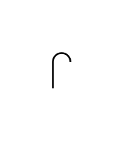

- [VentCover](./vent-cover.md)  
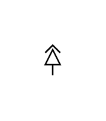

- [VesselDifferentDiameters](./vessel-different-diameters.md)  
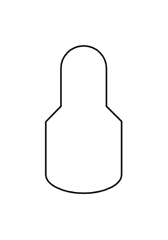

- [VesselDishedBottomSurfaceIndication](./vessel-dished-bottom-surface-indication.md)  

- [VesselDishedEndsBrackets](./vessel-dished-ends-brackets.md)  
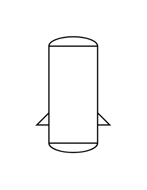

- [VesselDishedEndsElectricalHeating](./vessel-dished-ends-electrical-heating.md)  

- [VesselDishedEndsHeatingCoolingJacket](./vessel-dished-ends-heating-cooling-jacket.md)  
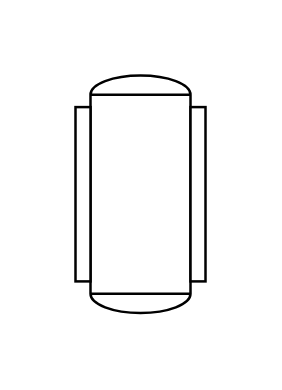

- [VesselDishedEndsLegs](./vessel-dished-ends-legs.md)  
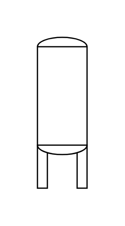

- [VesselDishedEndsRing](./vessel-dished-ends-ring.md)  
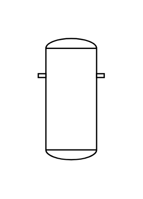

- [VesselDishedEndsSkirts](./vessel-dished-ends-skirts.md)  
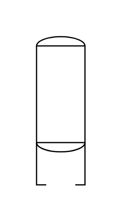

- [VesselDishedEndsThermalInsulation](./vessel-dished-ends-thermal-insulation.md)  
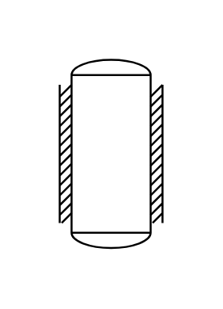

- [VesselDome](./vessel-dome.md)  

- [VesselFullTubeHeatingCoolingCoil](./vessel-full-tube-heating-cooling-coil.md)  

- [VesselPit](./vessel-pit.md)  

- [VesselSemiTubeHeatingCoolingCoil](./vessel-semi-tube-heating-cooling-coil.md)  

