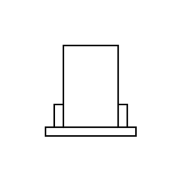

# Forced-Draft Cooling Tower

## Definition

```js
{
  _style: {
    entity: 'shape=mxgraph.pid.vessels.forced-draft_cooling_tower;html=1;pointerEvents=1;align=center;verticalLabelPosition=bottom;verticalAlign=top;dashed=0;',
  },
  _original_width: 99,
  _original_height: 99,

}
```

## Usage

```js
import { ForcedDraftCoolingTower } from '@dinghy/standard-components-diagrams/procEngVessels'

<ForcedDraftCoolingTower/>
```

## Preview


