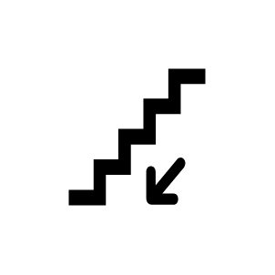

# Downstairs

## Definition

```js
{
  _style: {
    entity: 'shape=mxgraph.signs.travel.downstairs;html=1;pointerEvents=1;fillColor=#000000;strokeColor=none;verticalLabelPosition=bottom;verticalAlign=top;align=center;sketch=0;',
  },
  _original_width: 99,
  _original_height: 83,

}
```

## Usage

```js
import { Downstairs } from '@dinghy/standard-components-diagrams/signsTravel'

<Downstairs/>
```

## Preview


