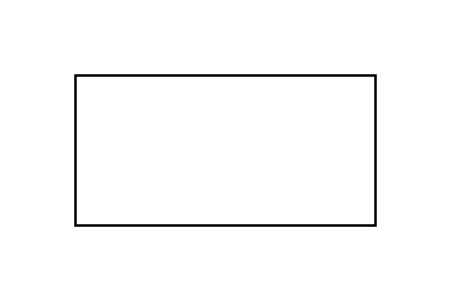
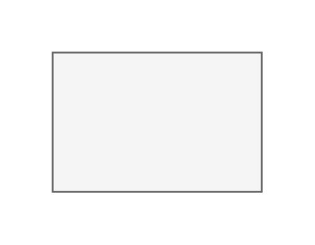
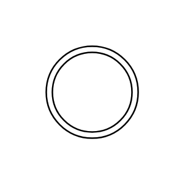
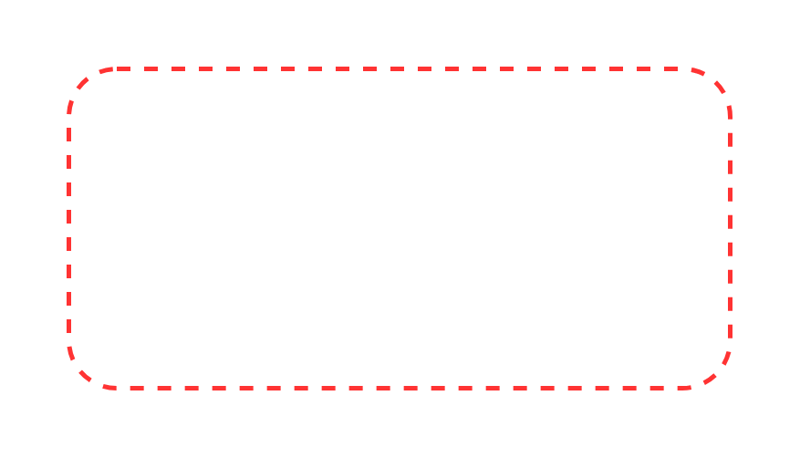
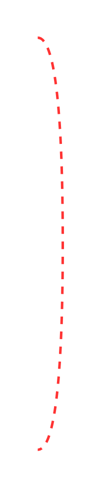

# Other Threat Modeling Entities

- [AndGate](./and-gate.md)  

- [AssetLabel](./asset-label.md)  

- [DataStore](./data-store.md)  

- [ExternalEntity](./external-entity.md)  

- [Label](./label.md)  

- [LeafNode](./leaf-node.md)  

- [MultiProcess](./multi-process.md)  

- [Note](./note.md)  

- [OrGate](./or-gate.md)  

- [Process](./process.md)  

- [SecurityControlLabel](./security-control-label.md)  

- [ThreatActorLabel](./threat-actor-label.md)  

- [TrustBoundary](./trust-boundary.md)  

- [TrustBoundary2](./trust-boundary-2.md)  

