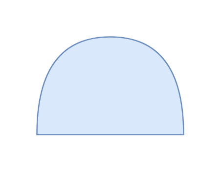

# AND Gate

## Definition

```js
{
  _style: {
    entity: 'shape=or;whiteSpace=wrap;html=1;direction=north;fillColor=#dae8fc;strokeColor=#6c8ebf;',
  },
  _width: 120,
  _height: 80,
}
```

## Usage

```js
import { AndGate } from '@dinghy/standard-components-diagrams/threatModeling'

<AndGate/>
```

## Preview


