# Software Active Directory Entities

- [ActiveDirectory](./active-directory.md)  

- [CdDvd](./cd-dvd.md)  

- [CellPhone](./cell-phone.md)  
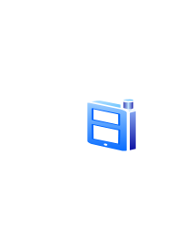

- [ClusterServer](./cluster-server.md)  

- [CommunityDiscussion](./community-discussion.md)  

- [DataJack](./data-jack.md)  

- [Database](./database.md)  

- [DatabaseCube](./database-cube.md)  

- [DatabasePartition2](./database-partition-2.md)  

- [DatabasePartition3](./database-partition-3.md)  

- [DatabasePartition4](./database-partition-4.md)  

- [DatabasePartition5](./database-partition-5.md)  

- [DatabaseServer](./database-server.md)  

- [Databases](./databases.md)  

- [Documents](./documents.md)  

- [DomainController](./domain-controller.md)  

- [Fax](./fax.md)  

- [Firewall](./firewall.md)  
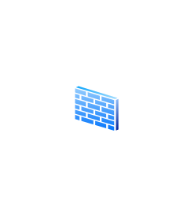

- [Folder](./folder.md)  

- [FolderOpen](./folder-open.md)  

- [GenericNode](./generic-node.md)  

- [GenericServer](./generic-server.md)  
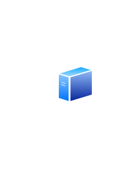

- [HardDisk](./hard-disk.md)  

- [Home](./home.md)  
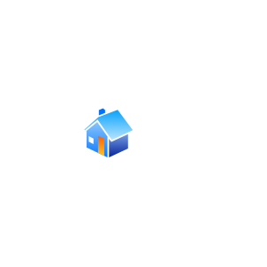

- [HomePage](./home-page.md)  

- [InputOutputFilter](./input-output-filter.md)  

- [Interface](./interface.md)  

- [InternetCloud](./internet-cloud.md)  

- [InternetGlobe](./internet-globe.md)  

- [Key](./key.md)  

- [LaptopClient](./laptop-client.md)  

- [List](./list.md)  

- [MacClient](./mac-client.md)  

- [Mainframe](./mainframe.md)  
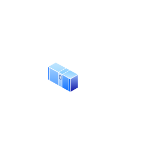

- [MainframeHost](./mainframe-host.md)  

- [Meeting](./meeting.md)  

- [Modem](./modem.md)  
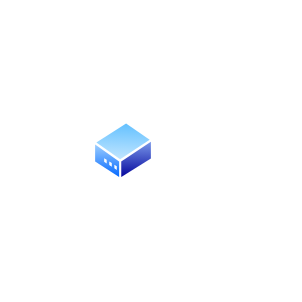

- [MySites](./my-sites.md)  

- [NotSecure](./not-secure.md)  

- [Pda](./pda.md)  

- [Phone](./phone.md)  

- [Printer](./printer.md)  

- [Router](./router.md)  

- [Secure](./secure.md)  

- [Security](./security.md)  

- [ServerFarm](./server-farm.md)  

- [ShadowedRouter](./shadowed-router.md)  
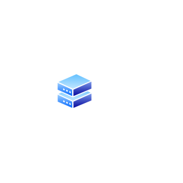

- [SiteCollection](./site-collection.md)  

- [SqlServer](./sql-server.md)  
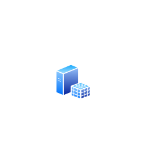

- [SubSite](./sub-site.md)  
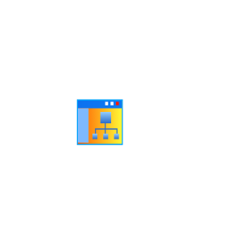

- [Switch](./switch.md)  

- [TabletPc](./tablet-pc.md)  

- [Tunnel](./tunnel.md)  

- [User](./user.md)  

- [UserAccounts](./user-accounts.md)  

- [Users](./users.md)  

- [VistaClient](./vista-client.md)  

- [VistaTerminal](./vista-terminal.md)  

- [WebServer](./web-server.md)  
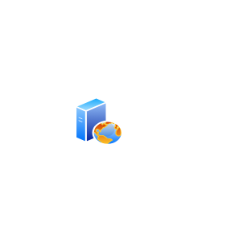

- [WikiSite](./wiki-site.md)  
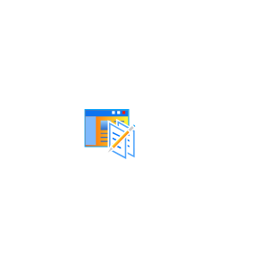

- [WindowsDomain](./windows-domain.md)  

- [WindowsRouter](./windows-router.md)  
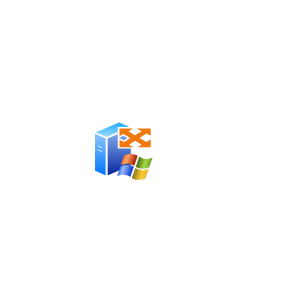

- [WindowsServer](./windows-server.md)  
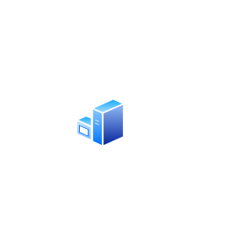

- [WindowsServer2](./windows-server-2.md)  
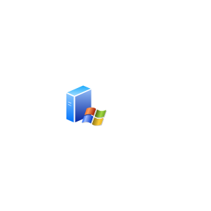

- [WiringHub](./wiring-hub.md)  
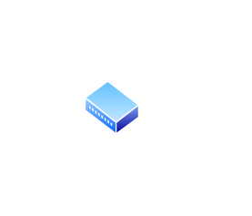

- [WorkspaceSite](./workspace-site.md)  
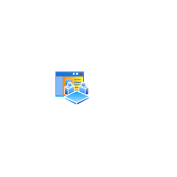

- [WorkstationClient](./workstation-client.md)  

- [Writer](./writer.md)  

- [Writing](./writing.md)  

