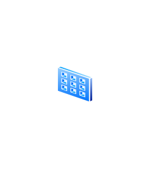

# Input/Output Filter

## Definition

```js
{
  _style: {
    entity: 'image;aspect=fixed;perimeter=ellipsePerimeter;html=1;align=center;shadow=0;dashed=0;spacingTop=3;image=img/lib/active_directory/input_output_filter.svg;strokeColor=none;',
  },
  _width: 33.5,
  _height: 50,
}
```

## Usage

```js
import { InputOutputFilter } from '@dinghy/standard-components-diagrams/activeDirectory'

<InputOutputFilter/>
```

## Preview


