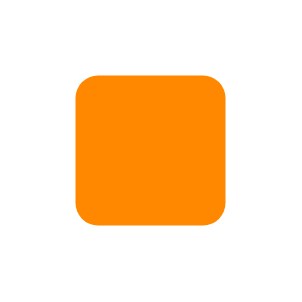

# Color 8

## Definition

```js
{
  _style: {
    entity: 'verticalLabelPosition=bottom;verticalAlign=top;html=1;shadow=0;dashed=0;strokeWidth=1;strokeColor=none;shape=rect;fillColor=#ff8800;',
  },
  _original_width: 50,
  _original_height: 50,

}
```

## Usage

```js
import { Color8 } from '@dinghy/standard-components-diagrams/android'

<Color8/>
```

## Preview


