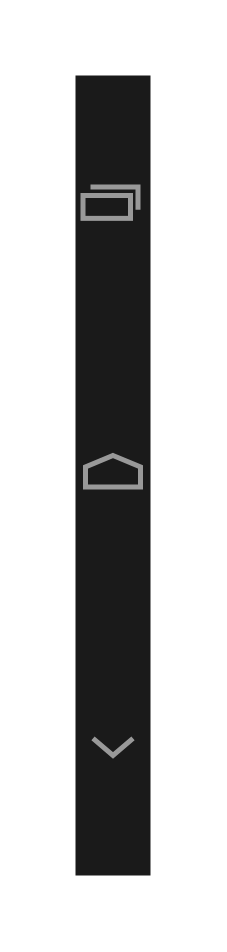

# Navigation Bar Vertical 2

## Definition

```js
{
  _style: {
    entity: 'verticalLabelPosition=bottom;verticalAlign=top;html=1;shadow=0;dashed=0;strokeWidth=2;shape=mxgraph.android.navigation_bar_5_vertical;fillColor=#1A1A1A;strokeColor=#999999;sketch=0;',
  },
  _width: 30,
  _height: 320,
}
```

## Usage

```js
import { NavigationBarVertical2 } from '@dinghy/standard-components-diagrams/android'

<NavigationBarVertical2/>
```

## Preview


