# Software Atlassian Entities

- [Atlassian](./atlassian.md)  

- [AvatarAvailable](./avatar-available.md)  

- [AvatarAway](./avatar-away.md)  

- [AvatarDoNotDisturb](./avatar-do-not-disturb.md)  

- [AvatarLarge](./avatar-large.md)  

- [AvatarMain](./avatar-main.md)  
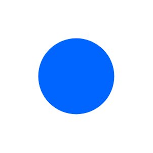

- [AvatarNormal](./avatar-normal.md)  
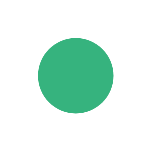

- [AvatarSmall](./avatar-small.md)  

- [AvatarTiny](./avatar-tiny.md)  

- [Bamboo](./bamboo.md)  

- [Banner](./banner.md)  

- [Banner2](./banner-2.md)  

- [Bitbucket](./bitbucket.md)  

- [BoldBadge](./bold-badge.md)  
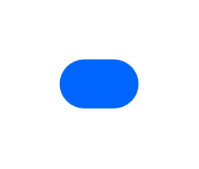

- [BoldToggleDisabled](./bold-toggle-disabled.md)  

- [BoldToggleWithTooltip](./bold-toggle-with-tooltip.md)  

- [BoldToggleWithTooltip2](./bold-toggle-with-tooltip-2.md)  

- [BoldToggleWithTooltip3](./bold-toggle-with-tooltip-3.md)  

- [Breadcrumb](./breadcrumb.md)  

- [ButtonAvatar](./button-avatar.md)  

- [ButtonAvatar2](./button-avatar-2.md)  

- [ButtonAvatar3](./button-avatar-3.md)  

- [ButtonCompact](./button-compact.md)  

- [ButtonCompact2](./button-compact-2.md)  

- [ButtonDisabled](./button-disabled.md)  

- [ButtonDropdownOpen](./button-dropdown-open.md)  

- [ButtonDropdownOpen2](./button-dropdown-open-2.md)  

- [ButtonDropdown](./button-dropdown.md)  

- [ButtonDropdown2](./button-dropdown-2.md)  

- [ButtonDropdown3](./button-dropdown-3.md)  

- [ButtonGroupedResponsive](./button-grouped-responsive.md)  

- [ButtonGrouped](./button-grouped.md)  

- [ButtonGrouped2](./button-grouped-2.md)  

- [ButtonGrouped3](./button-grouped-3.md)  

- [ButtonGrouped4](./button-grouped-4.md)  

- [ButtonIconAndLabel](./button-icon-and-label.md)  

- [ButtonLabelOnly](./button-label-only.md)  

- [ButtonLink](./button-link.md)  

- [ButtonLink2](./button-link-2.md)  

- [ButtonPrimary](./button-primary.md)  

- [ButtonPrimary2](./button-primary-2.md)  
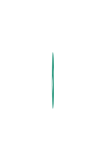

- [ButtonPrimary3](./button-primary-3.md)  

- [ButtonPrimary4](./button-primary-4.md)  

- [ButtonSplit](./button-split.md)  

- [ButtonStandard](./button-standard.md)  

- [ButtonStandard2](./button-standard-2.md)  

- [ButtonSubtle](./button-subtle.md)  

- [CheckboxOff](./checkbox-off.md)  

- [CheckboxGroup](./checkbox-group.md)  

- [CheckboxGroup2](./checkbox-group-2.md)  

- [CheckboxGroup3](./checkbox-group-3.md)  

- [CheckboxGroup4](./checkbox-group-4.md)  

- [CheckboxGroup5](./checkbox-group-5.md)  

- [Clover](./clover.md)  

- [Comment](./comment.md)  

- [Comment10](./comment-10.md)  

- [Comment11](./comment-11.md)  

- [Comment2](./comment-2.md)  

- [Comment3](./comment-3.md)  

- [Comment4](./comment-4.md)  

- [Comment5](./comment-5.md)  

- [Comment6](./comment-6.md)  

- [Comment7](./comment-7.md)  

- [Comment8](./comment-8.md)  

- [Comment9](./comment-9.md)  

- [CompactTextField](./compact-text-field.md)  

- [CompactTextField2](./compact-text-field-2.md)  

- [Confluence](./confluence.md)  

- [ContainerAvatarLarge](./container-avatar-large.md)  

- [ContainerAvatarMedium](./container-avatar-medium.md)  

- [ContainerAvatarSmall](./container-avatar-small.md)  

- [Crowd](./crowd.md)  

- [Crucible](./crucible.md)  

- [DatePicker](./date-picker.md)  

- [DatePicker2](./date-picker-2.md)  

- [DatePicker3](./date-picker-3.md)  

- [DatePicker4](./date-picker-4.md)  

- [DisabledTextField](./disabled-text-field.md)  

- [DisabledTextField2](./disabled-text-field-2.md)  

- [DisabledTextField3](./disabled-text-field-3.md)  

- [DisabledTextField4](./disabled-text-field-4.md)  

- [DisabledTextField5](./disabled-text-field-5.md)  

- [DisabledTextField6](./disabled-text-field-6.md)  

- [DisabledTextField7](./disabled-text-field-7.md)  

- [DisabledTextField8](./disabled-text-field-8.md)  

- [DotBadge](./dot-badge.md)  

- [ErrorMessage](./error-message.md)  

- [ErrorMessage2](./error-message-2.md)  

- [ErrorMessage3](./error-message-3.md)  

- [ErrorMessageField](./error-message-field.md)  

- [ErrorMessageField2](./error-message-field-2.md)  

- [Fisheye](./fisheye.md)  

- [Hipchat](./hipchat.md)  

- [InlineDialog](./inline-dialog.md)  

- [InlineDialog2](./inline-dialog-2.md)  

- [InlineDialog3](./inline-dialog-3.md)  

- [InlineDialog4](./inline-dialog-4.md)  

- [InlineEdit](./inline-edit.md)  

- [InlineEdit2](./inline-edit-2.md)  

- [InlineEdit3](./inline-edit-3.md)  

- [InlineEdit4](./inline-edit-4.md)  

- [InlineEdit5](./inline-edit-5.md)  

- [InlineEdit6](./inline-edit-6.md)  
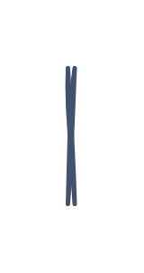

- [InlineMessage](./inline-message.md)  

- [InlineMessage2](./inline-message-2.md)  

- [InlineMessage3](./inline-message-3.md)  

- [InlineMessage4](./inline-message-4.md)  
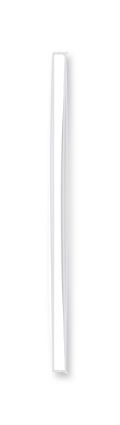

- [InlineMessageWithSubtitle](./inline-message-with-subtitle.md)  

- [InlineMessageWithSubtitle2](./inline-message-with-subtitle-2.md)  

- [InlineMessageWithSubtitle3](./inline-message-with-subtitle-3.md)  

- [Issue](./issue.md)  

- [Jira](./jira.md)  

- [JiraCore](./jira-core.md)  

- [JiraServiceDesk](./jira-service-desk.md)  

- [JiraSoftware](./jira-software.md)  

- [LinearDiscussion](./linear-discussion.md)  
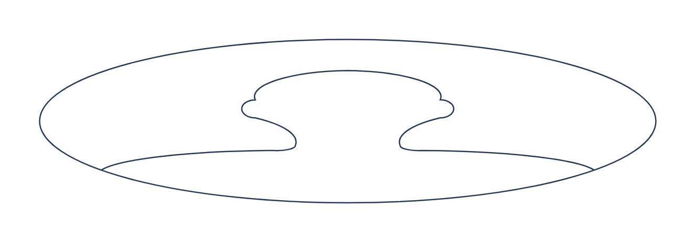

- [LozengeCurrentBold](./lozenge-current-bold.md)  

- [LozengeCurrentSubtle](./lozenge-current-subtle.md)  

- [LozengeMovedBold](./lozenge-moved-bold.md)  

- [LozengeMovedSubtle](./lozenge-moved-subtle.md)  

- [LozengeNewBold](./lozenge-new-bold.md)  

- [LozengeNewSubtle](./lozenge-new-subtle.md)  

- [LozengeProblemBold](./lozenge-problem-bold.md)  

- [LozengeProblemSubtle](./lozenge-problem-subtle.md)  
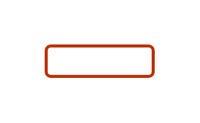

- [LozengeStateBold](./lozenge-state-bold.md)  

- [LozengeStateSubtle](./lozenge-state-subtle.md)  

- [LozengeSuccessBold](./lozenge-success-bold.md)  

- [LozengeSuccessSubtle](./lozenge-success-subtle.md)  
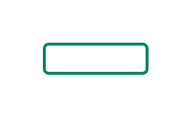

- [LozengeTooltip](./lozenge-tooltip.md)  

- [ModalDialog](./modal-dialog.md)  
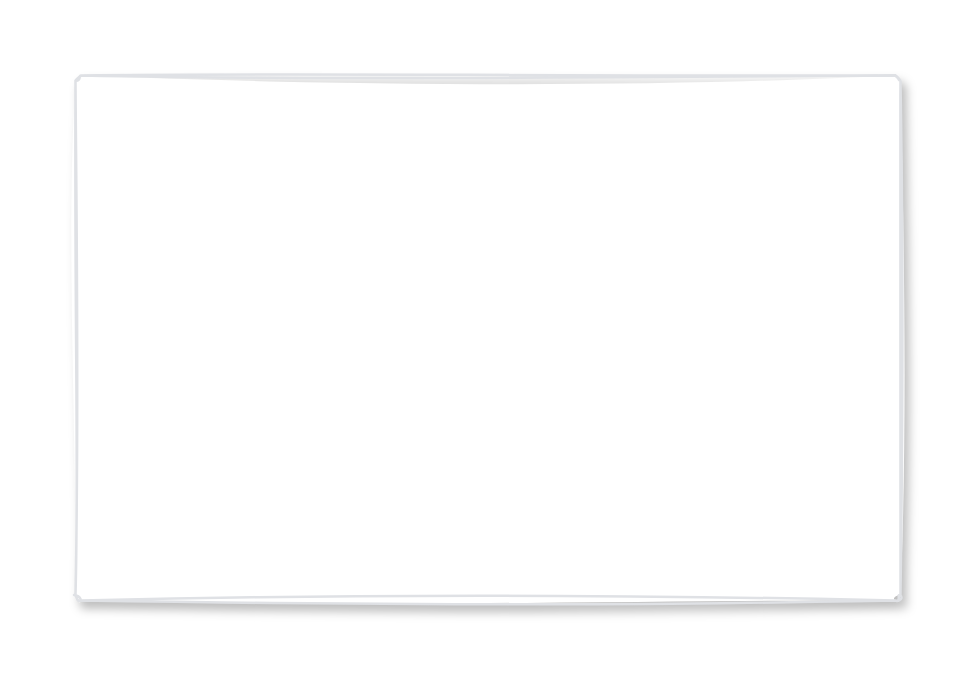

- [ModalDialogDetailed](./modal-dialog-detailed.md)  
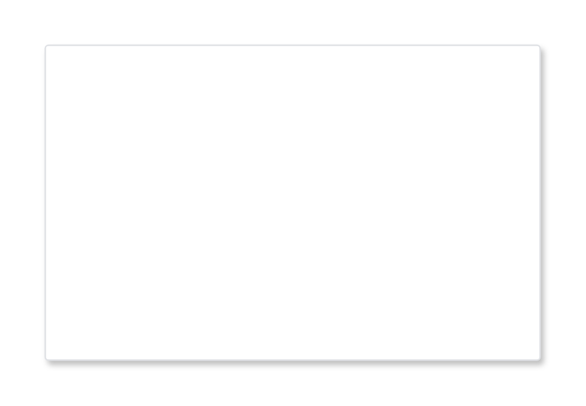

- [ModalDialogError](./modal-dialog-error.md)  

- [ModalDialogSmall](./modal-dialog-small.md)  

- [MultiSelect](./multi-select.md)  

- [MultiSelect2](./multi-select-2.md)  

- [MultiSelect3](./multi-select-3.md)  

- [MultiSelectWithAvatars](./multi-select-with-avatars.md)  

- [MultipleFlagMessage](./multiple-flag-message.md)  

- [ProgressTracker](./progress-tracker.md)  
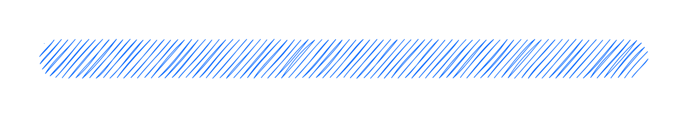

- [ProgressTracker2](./progress-tracker-2.md)  

- [ProgressTracker3](./progress-tracker-3.md)  

- [ProgressTracker4](./progress-tracker-4.md)  

- [RadioButtonGroup](./radio-button-group.md)  

- [RadioButtonGroup2](./radio-button-group-2.md)  

- [RadioButtonGroup3](./radio-button-group-3.md)  

- [RemovableTag](./removable-tag.md)  

- [RemovableTagLink](./removable-tag-link.md)  

- [SingleSelect](./single-select.md)  
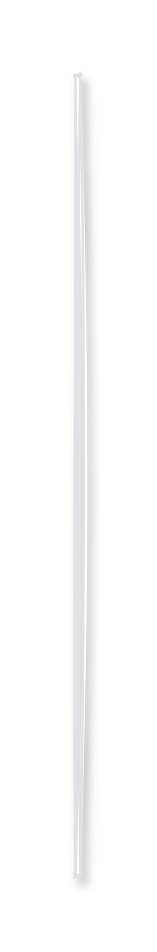

- [SingleSelectGrouped](./single-select-grouped.md)  

- [SingleSelectGrouped2](./single-select-grouped-2.md)  

- [SingleSelectGrouped3](./single-select-grouped-3.md)  

- [Sourcetree](./sourcetree.md)  

- [Statuspage](./statuspage.md)  

- [Stride](./stride.md)  

- [SubtleBadge](./subtle-badge.md)  
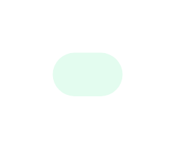

- [SubtleToggle](./subtle-toggle.md)  
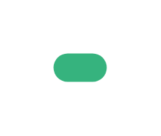

- [Table](./table.md)  

- [Table10](./table-10.md)  

- [Table11](./table-11.md)  

- [Table12](./table-12.md)  

- [Table13](./table-13.md)  

- [Table14](./table-14.md)  

- [Table15](./table-15.md)  
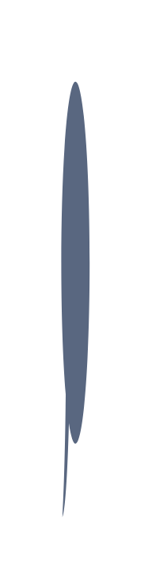

- [Table16](./table-16.md)  

- [Table17](./table-17.md)  

- [Table18](./table-18.md)  

- [Table19](./table-19.md)  
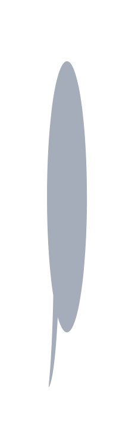

- [Table2](./table-2.md)  

- [Table20](./table-20.md)  

- [Table21](./table-21.md)  
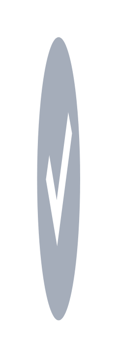

- [Table22](./table-22.md)  

- [Table23](./table-23.md)  

- [Table24](./table-24.md)  

- [Table25](./table-25.md)  

- [Table26](./table-26.md)  

- [Table27](./table-27.md)  

- [Table28](./table-28.md)  

- [Table29](./table-29.md)  

- [Table3](./table-3.md)  

- [Table30](./table-30.md)  

- [Table31](./table-31.md)  

- [Table32](./table-32.md)  

- [Table33](./table-33.md)  

- [Table34](./table-34.md)  
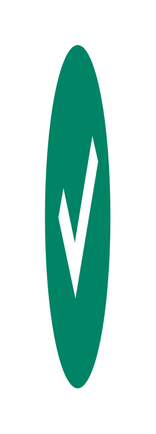

- [Table4](./table-4.md)  
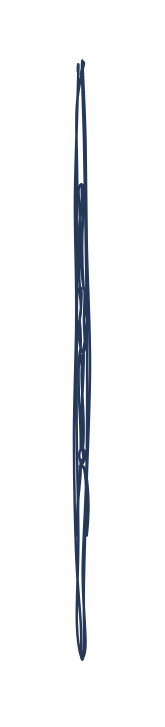

- [Table5](./table-5.md)  

- [Table6](./table-6.md)  

- [Table7](./table-7.md)  

- [Table8](./table-8.md)  

- [Table9](./table-9.md)  

- [TableWithAction](./table-with-action.md)  

- [TableWithAction2](./table-with-action-2.md)  

- [TableWithAction3](./table-with-action-3.md)  

- [TableWithAction4](./table-with-action-4.md)  

- [Tag](./tag.md)  

- [TagLink](./tag-link.md)  

- [TextField](./text-field.md)  

- [TextField2](./text-field-2.md)  

- [TextFieldWithTooltip](./text-field-with-tooltip.md)  

- [TextFieldWithTooltip2](./text-field-with-tooltip-2.md)  

- [TextFieldWithTooltip3](./text-field-with-tooltip-3.md)  

- [TextFieldWithTooltip4](./text-field-with-tooltip-4.md)  

- [TextFieldWithTooltip5](./text-field-with-tooltip-5.md)  

- [Tooltip](./tooltip.md)  

- [Trello](./trello.md)  

