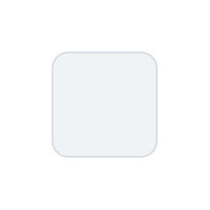

# Checkbox (off)

## Definition

```js
{
  _style: {
    entity: 'rounded=1;fillColor=#F0F2F5;strokeColor=#D8DCE3;align=left;verticalAlign=middle;fontStyle=0;fontSize=12;labelPosition=right;verticalLabelPosition=middle;spacingLeft=10;html=1;shadow=0;dashed=0',
  },
  _original_width: 12,
  _original_height: 12,

}
```

## Usage

```js
import { CheckboxOff } from '@dinghy/standard-components-diagrams/atlassian'

<CheckboxOff/>
```

## Preview


