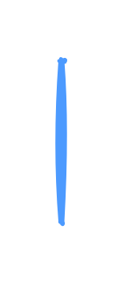

# Text field with tooltip 4

## Definition

```js
{
  _style: {
    entity: 'rounded=1;arcSize=9;fillColor=#ffffff;align=left;spacingLeft=5;strokeColor=#4C9AFF;html=1;strokeWidth=2;fontColor=#000000;fontSize=12;sketch=1;hachureGap=4;pointerEvents=0;fontFamily=Architects Daughter;fontSource=https%3A%2F%2Ffonts.googleapis.com%2Fcss%3Ffamily%3DArchitects%2BDaughter;',
  },
  _width: 1,
  _height: 80,
}
```

## Usage

```js
import { TextFieldWithTooltip4 } from '@dinghy/standard-components-diagrams/atlassian'

<TextFieldWithTooltip4/>
```

## Preview


